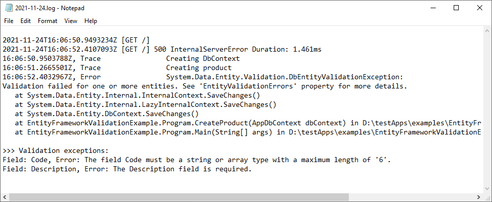

Entity Framework validation
=============================================

When Entity Framework attempts to save an entity and the validation fails, ``db.SaveChanges()`` will throw a generic exception.

You can use ``KissLogConfiguration.Options.AppendExceptionDetails`` handler to intercept the validation exception and log the validation errors.

A full working example can be found `here <https://github.com/KissLog-net/KissLog.Sdk/tree/master/testApps/examples/EntityFrameworkValidationExample>`_.

.. code-block:: c#

    private static void ConfigureKissLog()
    {
        KissLogConfiguration.Options
            .AppendExceptionDetails((Exception ex) =>
            {
                StringBuilder sb = new StringBuilder();

                if (ex is System.Data.Entity.Validation.DbEntityValidationException dbException)
                {
                    sb.AppendLine(">>> Validation exceptions:");

                    foreach (var error in dbException.EntityValidationErrors.SelectMany(p => p.ValidationErrors))
                    {
                        string message = string.Format("Field: {0}, Error: {1}", error.PropertyName, error.ErrorMessage);
                        sb.AppendLine(message);
                    }
                }

                return sb.ToString();
            });

        KissLogConfiguration.Listeners
            .Add(new LocalTextFileListener("logs", FlushTrigger.OnFlush));
    }

