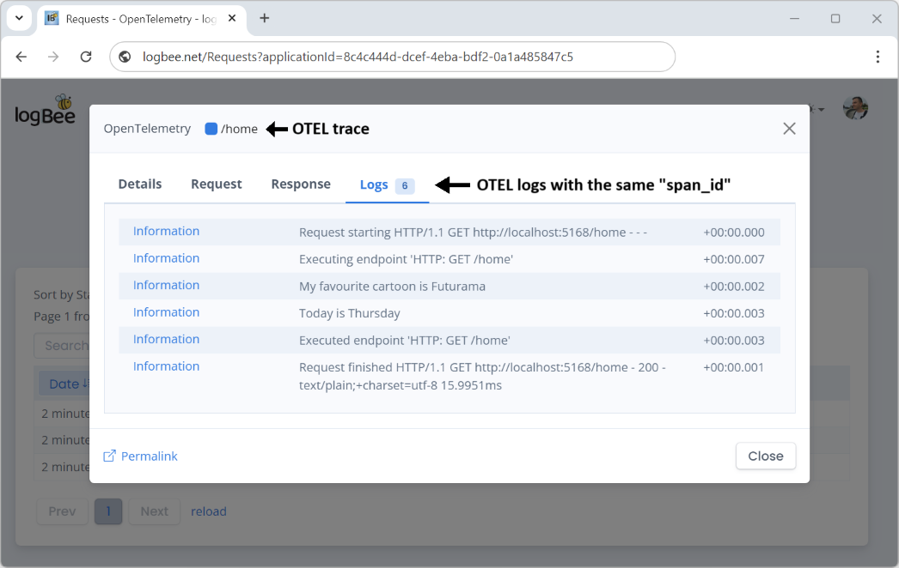

OpenTelemetry (OTEL)
============================

OpenTelemetry (OTEL) is an open-source observability framework that provides APIs, libraries, and instrumentation to capture and export telemetry data (traces, metrics, logs) to monitoring platforms like Logbee.

Example of OpenTelemetry Collector and .NET integrations can be found on the `OpenTelemetry GitHub page <https://github.com/catalingavan/logbee-integrations-examples/tree/main/OpenTelemetry>`_.

Trace
----------------------------------------------

Logbee saves OpenTelemetry traces as individual requests, using the trace's ``span_id`` to uniquely identify each request. A trace represents an end-to-end request (e.g., a web request), and each span represents a single operation within that request (e.g., a HTTP request).

Logs
----------------------------------------------

OpenTelemetry logs that are correlated with a trace (i.e., where the ``span_id`` in the log matches the ``span_id`` of a trace) are automatically linked in Logbee. This allows for easy identification and investigation of logs alongside the trace they belong to.

Logs that do not have an associated trace (i.e., logs with an empty ``span_id``) are saved separately. This usually represents logs that are generated independently of any request or operation being traced. Logbee groups these logs together into 5-minute intervals, which helps in monitoring untraced activity in your system.

.. figure:: images/otel-logs.png
   :alt: Logs that do not have an associated trace

.. toctree::
   :hidden:

   OpenTelemetryCollector