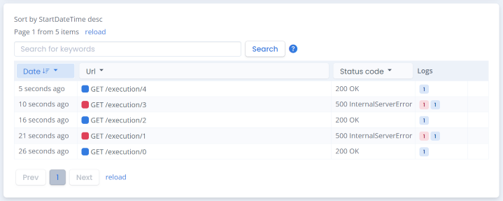

Non-web applications
=====================

.NET non-web applications can use `Serilog <https://github.com/serilog/serilog>`_ to write events to logBee.net.

`Serilog LogBee Sink <https://github.com/logBee-net/serilog-sinks-logbee>`_ stores all the events in memory and submits them to the logBee endpoint when the Serilog logger is flushed.

.. contents:: Contents
   :local:

Install Instructions
----------------------------------------------

A full working example can be found `here <https://github.com/logBee-net/serilog-sinks-logbee/tree/main/samples/Serilog.Sinks.LogBee_ConsoleApp>`_.

1. Install NuGet Package

.. code-block:: none
    :caption: Package Manager Console

    PM> Install-Package Serilog.Sinks.LogBee
   

2. Update **Program.cs**

.. code-block:: c#
    :caption: Program.cs

    using Serilog.Sinks.LogBee;

    namespace Serilog.Sinks.LogBee_ConsoleApp;

    class Program
    {
        static void Main(string[] args)
        {
            Log.Logger =
                new LoggerConfiguration()
                    .WriteTo.LogBee(
                        new LogBeeApiKey(
                            "_OrganizationId_",
                            "_ApplicationId_",
                            "https://api.logbee.net"
                        )
                    )
                    .CreateLogger();

            try
            {
                string name = "Serilog";
                Log.Information("Hello, {Name}!", name);

                throw new NullReferenceException("Oops...");
            }
            catch (Exception ex)
            {
                Log.Error(ex, "Unhandled exception");
            }
            finally
            {
                // make sure you flush the logger so the events are sent to the logBee endpoint
                Log.CloseAndFlush();
            }
        }
    }

Advanced usage
----------------------------------------------

logBee.net saves the log events under individual "Requests".

For non-web applications, a "Request" can be seen as an individual "application execution".

A ``NonWebLoggerContext`` can be used to configure the "Request" properties associated for the captured events.

.. code-block:: c#
    :caption: Program.cs

    using Serilog.Sinks.LogBee;

    namespace Serilog.Sinks.LogBee_ConsoleApp;

    class Program
    {
        static async Task Main(string[] args)
        {
            var loggerContext = new NonWebLoggerContext();

            Log.Logger =
                new LoggerConfiguration()
                    .WriteTo.LogBee(
                        new LogBeeApiKey(
                            "_OrganizationId_",
                            "_ApplicationId_",
                            "https://api.logbee.net"
                        ),
                        loggerContext
                    )
                    .CreateLogger();

            int executionCount = 0;
            while (true)
            {
                loggerContext.Reset($"http://application/execution/{executionCount}");

                Log.Information("First log message from Serilog");

                try
                {
                    // execute some code

                    if (executionCount % 2 == 1)
                        throw new Exception("Oops, odd execution error");
                }
                catch (Exception ex)
                {
                    Log.Error(ex, "Error executing some code");
                    loggerContext.SetResponseProperties(new ResponseProperties(500));
                }
                finally
                {
                    await loggerContext.FlushAsync();
                }

                await Task.Delay(5000);
                executionCount++;
            }
        }
    }

