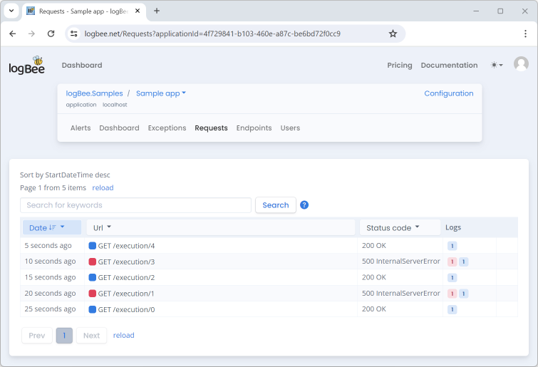

Console applications
=====================

Console applications using `Serilog <https://github.com/serilog/serilog>`_ can integrate the ``Serilog.Sinks.LogBee`` Sink to write events to logBee.net.

.. code-block:: c#

    var log = new LoggerConfiguration()
        .WriteTo.LogBee(
            new LogBeeApiKey("_OrganizationId_", "_ApplicationId_", "https://api.logbee.net")
        )
        .CreateLogger();

.. contents:: Contents
   :local:

Saving the logs
----------------------------------------------

The ``Serilog.Sinks.LogBee`` Sink stores all the events in memory and submits them to the logBee endpoint when the Serilog logger is flushed.

For this reason, you always need to call ``Log.CloseAndFlush()`` method before the program execution completes.

.. code-block:: c#

    Log.Logger = new LoggerConfiguration()
        .WriteTo.LogBee(new LogBeeApiKey("_OrganizationId_", "_ApplicationId_", "https://api.logbee.net"))
        .CreateLogger();

    try
    {
        Log.Information("Hello, {Name}!", name);
    }
    catch(Exception ex)
    {
        Log.Error(ex, "Unhandled exception");
    }
    finally
    {
        // send the events to logBee.net
        Log.CloseAndFlush();
    }

Advanced usage
----------------------------------------------

logBee.net saves the log events under individual "Requests".

For console applications, a "Request" can be seen as an individual application execution.

Using a ``loggerContext``, you can configure the properties of the "Requests" generated by the different application executions.

.. code-block:: c#

    using Serilog.Sinks.LogBee;

    namespace Serilog.Sinks.LogBee_ConsoleApp;

    class Program
    {
        static void Main(string[] args)
        {
            var loggerContext = new NonWebLoggerContext();

            Log.Logger = new LoggerConfiguration()
                .WriteTo.LogBee(
                    new LogBeeApiKey("_OrganizationId_", "_ApplicationId_", "https://api.logbee.net"),
                    loggerContext
                )
                .CreateLogger();

            Foo(loggerContext);
            Bar(loggerContext);
        }

        static void Foo(NonWebLoggerContext loggerContext)
        {
            loggerContext.Reset("http://application/foo");

            Log.Information("Foo execution");

            // send the logs to logBee.net
            loggerContext.Flush();
        }

        static void Bar(NonWebLoggerContext loggerContext)
        {
            loggerContext.Reset("http://application/bar");

            Log.Information("Bar execution");

            // send the logs to logBee.net
            loggerContext.Flush();
        }
    }

.. image:: images/requests.png
    :alt: foo/bar requests

Microsoft.Extensions.Logging
----------------------------------------------

The ``Serilog.Sinks.LogBee`` Sink works with the logging provider by the .NET Core.

To use the Microsoft.Extensions.Logging framework, you will also need to install the `Serilog.Extensions.Hosting <https://github.com/serilog/serilog-extensions-hosting>`_ NuGet package.

.. code-block:: c#

    using Microsoft.Extensions.DependencyInjection;
    using Microsoft.Extensions.Logging;
    using Serilog.Sinks.LogBee;

    namespace Serilog.Sinks.LogBee_ConsoleApp;

    class Program
    {
        static void Main(string[] args)
        {
            var loggerContext = new NonWebLoggerContext();

            Log.Logger = new LoggerConfiguration()
                .WriteTo.LogBee(
                    new LogBeeApiKey("_OrganizationId_", "_ApplicationId_", "https://api.logbee.net"),
                    loggerContext
                )
                .CreateLogger();

            var services = new ServiceCollection();
            services.AddLogging((builder) =>
            {
                builder.AddSerilog();
            });

            // we inject the loggerContext so we can access it later, if needed
            services.AddSingleton(loggerContext);

            var serviceProvider = services.BuildServiceProvider();

            var logger = serviceProvider.GetRequiredService<ILogger<Program3>>();
            logger.LogInformation("Hi there");

            Log.CloseAndFlush();
        }
    }

"Request" properties
----------------------------------------------

In console applications where the concept of requests may not apply directly, the ``NonWebLoggerContext`` can be used to configure the "HTTP" properties that are saved in logBee.net.

Configuring the "Requests" can be useful for identifying and filtering different application executions in the logBee.net user-interface.

.. code-block:: c#

    using Serilog.Sinks.LogBee;

    namespace Serilog.Sinks.LogBee_ConsoleApp;

    class Program
    {
        static async Task Main(string[] args)
        {
            var loggerContext = new NonWebLoggerContext();

            Log.Logger = new LoggerConfiguration()
                .WriteTo.LogBee(
                    new LogBeeApiKey("_OrganizationId_", "_ApplicationId_", "https://api.logbee.net"),
                    loggerContext
                )
                .CreateLogger();

            int executionCount = 0;
            while (true)
            {
                loggerContext.Reset(new RequestProperties($"http://application/execution/{executionCount}")
                {
                    Headers = new Dictionary<string, string>
                    {
                        { "key1", "value1" }
                    }
                });

                Log.Information("First log message from Serilog");

                try
                {
                    // execute some code

                    if (executionCount % 2 == 1)
                        throw new Exception("Oops, odd execution error");
                }
                catch (Exception ex)
                {
                    Log.Error(ex, "Error executing some code");

                    // if we had an error, we set the "StatusCode" to 500
                    loggerContext.SetResponseProperties(new ResponseProperties(500));
                }
                finally
                {
                    // flush the logs to the logBee endpoint
                    await loggerContext.FlushAsync();
                }

                await Task.Delay(5000);
                executionCount++;
            }
        }
    }

Logging files
----------------------------------------------

You can use the ``loggerContext`` to save string contents as files.

.. code-block:: c#

    var loggerContext = new NonWebLoggerContext("/file-example");

    Log.Logger = new LoggerConfiguration()
        .WriteTo.LogBee(
            new LogBeeApiKey("_OrganizationId_", "_ApplicationId_", "https://api.logbee.net"),
            loggerContext
        )
        .CreateLogger();

    Log.Information("Info message");
    Log.Warning("War message");

    loggerContext.LogAsFile(JsonSerializer.Serialize(new
    {
        eventCode = "AUTHORISATION",
        amount = new
        {
            currency = "USD",
            value = 12
        }
    }), "Event.json");

    Log.CloseAndFlush();

.. image:: images/request_files_tab.png
    :alt: Request Files tab

.. image:: images/request_file_preview.png
    :alt: Request File preview

Examples
----------------------------------------------

* `Simple usage <https://github.com/logBee-net/serilog-sinks-logbee/blob/main/samples/Serilog.Sinks.LogBee_ConsoleApp/Program1.cs>`_ 
* `Custom "Request" properties <https://github.com/logBee-net/serilog-sinks-logbee/blob/main/samples/Serilog.Sinks.LogBee_ConsoleApp/Program2.cs>`_
* `Using Microsoft.Extensions.Logging and Microsoft.Extensions.DependencyInjection <https://github.com/logBee-net/serilog-sinks-logbee/blob/main/samples/Serilog.Sinks.LogBee_ConsoleApp/Program3.cs>`_
* `A console application which runs periodically <https://github.com/logBee-net/serilog-sinks-logbee/blob/main/samples/Serilog.Sinks.LogBee_ConsoleApp/Program4.cs>`_
* `Worker service <https://github.com/logBee-net/serilog-sinks-logbee/tree/main/samples/Serilog.Sinks.LogBee_WorkerService>`_

:doc:`Install instructions </integrations/Serilog-net/console-apps/install-instructions>`
---------------------------------------------------------------------------------------------------------

.. toctree::
   :hidden:

   install-instructions
