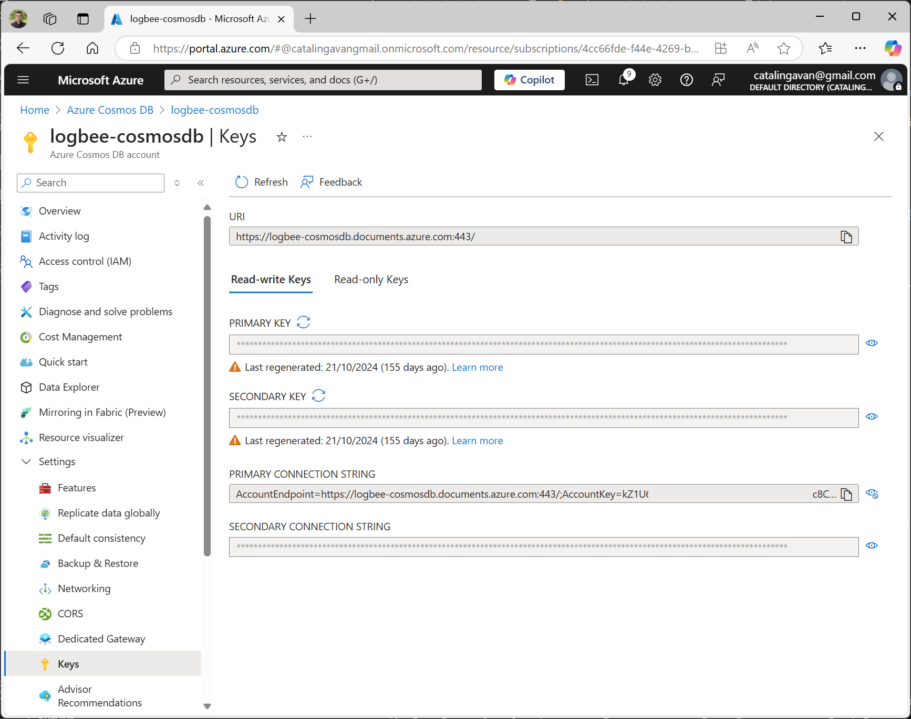
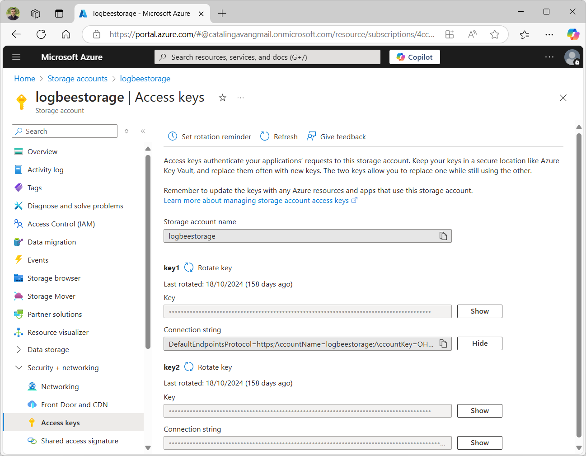
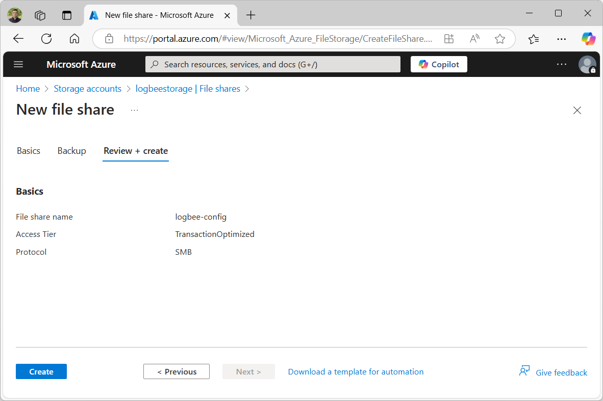
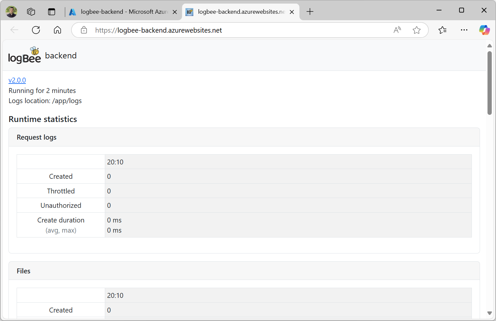

Installation guide
=============================

.. contents:: Table of contents
   :local:

This tutorial will guide trough the installation steps for Logbee in Microsoft Azure.

Set up prerequisites
-------------------------------------------------------

Azure Cosmos DB
~~~~~~~~~~~~~~~~~~~~~

Create an Azure Cosmos DB account. Select **Azure Cosmos DB for NoSQL**.

.. list-table::
   :header-rows: 1

   * - Properties
     - 
   * - Account Name
     - logbee-cosmosdb *(or any value)*
   * - Availability Zones
     - Disable
   * - Location
     - (Europe) West Europe *<or any appropriate value>*
   * - Capacity mode
     - Provisioned throughput
   * - Apply Free Tier Discount
     - Apply
   * - Limit total account throughput
     - Checked
   * - Geo-Redundancy
     - Disable
   * - Multi-region Writes
     - Disable
   * - Connectivity method
     - All networks
   * - Backup policy
     - Continuous (7 days) *(available for free)*
   * - Data Encryption
     - Service-managed key

Once the Azure Cosmos DB account has been created, navigate to **Settings > Keys** and copy the "PRIMARY CONNECTION STRING" to a text editor.

Storage account
~~~~~~~~~~~~~~~~~~~~~

Logbee uses Azure storage account for saving blob files and for reducing the workload of Azure Cosmos DB.

Create a storage account with the following properties:

.. list-table::
   :header-rows: 1

   * - Properties
     - 
   * - Storage account name
     - logbeestorage *(or any value)*
   * - Region
     - (Europe) West Europe *<or any appropriate value>*
   * - Primary service
     - Azure Blob Storage or Azure Data Lake Storage Gen 2
   * - Performance
     - Standard
   * - Redundancy
     - Locally-redundant storage (LRS)
   * - Access tier
     - Hot
   * - Public network access
     - Enable
   * - Public network access scope
     - Enable from all networks
   * - Encryption type
     - Microsoft-managed keys (MMK)

Once the Storage account has been created, navigate to **Security & networking > Access keys** and copy the "Connection string" to a text editor.

Navigate to **Data storage > File shares** and create a new File share.

.. list-table::
   :header-rows: 1

   * - Properties
     - 
   * - Name
     - logbee-config
   * - Access tier
     - Transaction optimized
   * - Enable backup
     - Unchecked

Logbee.Backend Web App Service 
~~~~~~~~~~~~~~~~~~~~~~~~~~~~~~~~~~~~~~~

Create a Web App App Service with the following properties:

.. list-table::
   :header-rows: 1

   * - Properties
     - 
   * - Name
     - logbee-backend (or any appropriate value)
   * - Publish
     - Container
   * - Operating System
     - Linux
   * - Region
     - West Europe (or any appropriate value)
   * - Pricing plan
     - Basic B3 (see notes below)
   * - Image Source
     - Quickstart (we will change this after the resource is created)
   * - Operating System
     - Linux

Once the App service has been created, navigate to the **Overview** menu and click "Browse".
If everything went ok, you should see a successful web page.

Copy the value of the URL in a text file. The URL should be a value looking like this: ``https://{app-service-name}.azurewebsites.net/``

Logbee.Frontend Web App Service 
~~~~~~~~~~~~~~~~~~~~~~~~~~~~~~~~~~~~~~~

Create a Web App App Service with the following properties:

.. list-table::
   :header-rows: 1

   * - Properties
     - 
   * - Name
     - logbee-frontend (or any appropriate value)
   * - Publish
     - Container
   * - Operating System
     - Linux
   * - Region
     - West Europe (or any appropriate value)
   * - Pricing plan
     - Basic B2 (see notes below)
   * - Image Source
     - Quickstart (we will change this after the resource is created)
   * - Operating System
     - Linux

Once the App service has been created, navigate to the **Overview** menu and click "Browse".
If everything went ok, you should see a successful web page.

Copy the value of the URL in a text file. The URL should be a value looking like this: ``https://{app-service-name}.azurewebsites.net/``

Prepare the configuration files
-------------------------------------------------------

\1. Download the configuration files for both Logbee.Frontend and Logbee.Backend and save them locally:

- `backend.logbee.json <https://github.com/catalingavan/logbee-app/blob/main/logbee.Backend/logbee.json>`_

- `frontend.logbee.json <https://github.com/catalingavan/logbee-app/blob/main/logbee.Frontend/logbee.json>`_

.. code-block:: none

    /logbee-config
    ├── backend.logbee.json
    └── frontend.logbee.json

\2. Update the **backend.logbee.json** configuration file with the keys from the recently created azure services:

.. code-block:: json
    
    {
        "LogbeeFrontendConfigurationFilePath": "configuration/frontend.logbee.json",
        "LogbeeBackendUrl": "https://logbee-backend.azurewebsites.net",
        "Database": {
            "Provider": "AzureCosmosDb",
            "AzureCosmosDb": {
                "ApplicationRegion": "West Europe",
                "ConnectionString": "<Azure Cosmos DB Connection string>",
                "DatabaseName": "logbee-backend",
                "AzureStorageAccountConnectionString": "<Storage account Connection string>"
            }
        },
        "FileStorage": {
            "Provider": "Azure",
            "Azure": {
                "ConnectionString": "<Storage account Connection string>"
            }
        }
    }

- **LogbeeBackendUrl** must be updated with the Logbee.Backend App Service URL.

- **Database.AzureCosmosDb.ApplicationRegion** must be updated with the region name where the Azure Cosmos DB has been created.

\3. Update the **frontend.logbee.json** configuration file:

.. code-block:: json
    
    {
      "LogbeeBackendConfigurationFilePath": "configuration/backend.logbee.json",
      "LogbeeFrontendUrl": "https://logbee-frontend.azurewebsites.net",
      "Database": {
        "Provider": "AzureCosmosDb",
        "AzureCosmosDb": {
          "ConnectionString": "<Azure Cosmos DB Connection string>",
          "ApplicationRegion": "West Europe",
          "DatabaseName": "logbee-frontend",
          "AzureStorageAccountConnectionString": "<Storage account Connection string>"
        }
      }
    }

- **LogbeeFrontendUrl** must be updated with the Logbee.Frontend App Service URL.

- **Database.AzureCosmosDb.ApplicationRegion** must be updated with the region name where the Azure Cosmos DB has been created.

Upload the configuration files
-------------------------------------------------------

Navigate to the recently created Storage account and go to **Data storage > File shares** menu.

Select the ``logbee-config`` file share and upload the two configuration files.

.. figure:: images/storage-account-logbee-config-file-share.png
    :alt: logbee-config file share

Update Logbee.Backend App Service
-------------------------------------------------------

Create Storage Mount
~~~~~~~~~~~~~~~~~~~~~~~~~~~~~~~~~~~~~~~

On the Logbee.Backend App Service, navigate to **Settings > Configuration**, select the **Path mappings** tab and click the **New Azure Storage Mount** button.

Create a new Azure Storage Mount with the following properties:

.. list-table::
   :header-rows: 1

   * - Properties
     - 
   * - Name
     - **config-mount**
   * - Configuration options
     - Basic
   * - Storage accounts
     - **logbeestorage** (select the value from the dropdown list)
   * - Storage type
     - Azure Files
   * - Protocol
     - SMB
   * - Storage container
     - **logbee-config** (select the value from the dropdown list)
   * - Mount path
     - **/configuration**

Once the Storage mount has been created, click the **Save** button (the App Service will restart).

By adding the Azure Storage Mount, we can now inject the recently uploaded configuration files in the App Service container.

(Optional) Enable App Service logs
~~~~~~~~~~~~~~~~~~~~~~~~~~~~~~~~~~~~~~~

Enabling App Service logs will expose the container logs to the host application, allowing for easier troubleshooting issues.

On the Logbee.Backend App Service, navigate to **Monitoring > App Service logs** and update the following properties:

.. list-table::
   :header-rows: 1

   * - Properties
     - 
   * - Application logging
     - File System
   * - Quota (MB)
     - 35
   * - Retention Period (Days)
     - 1

Click the **Save** button.

Update the container configuration
~~~~~~~~~~~~~~~~~~~~~~~~~~~~~~~~~~~~~~~

On the Logbee.Backend App Service, navigate to **Deployment > Deployment Center** and select the **Settings** tab.

Update the following properties:

.. list-table::
   :header-rows: 1

   * - Properties
     - 
   * - Source
     - Container Registry
   * - Container type
     - Docker Compose (Preview)
   * - Registry source
     - Docker Hub
   * - Repository Access
     - Public

Set the **Config** textarea to the following:

.. code-block:: json
    
    version: "3.7"
    services:
      backend:
        image: catalingavan/logbee.backend:2.0.0
        init: true
        restart: unless-stopped
        volumes:
          - config-mount:/app/configuration
        environment:
          - ASPNETCORE_URLS=http://0.0.0.0:80
          - LOGBEE_BACKEND_CONFIGURATION_FILE_PATH=configuration/backend.logbee.json
        ports:
          - "44080:80"

Click the **Save** button and **restart** the App Service for the new changes to be refected.

Once the App Service has been restarted, you shoud now see the Logbee.Backend application running:

