Installation guide
=============================

.. contents:: Table of contents
   :local:

Prerequisites
-------------------------------------------------------

Artifacts
~~~~~~~~~~~~~~~~~~~~~~~

- logBee.Backend-{version}-linux-x64.zip
- logBee.Frontend-{version}-linux-x64.zip

Artifacts can be downloaded from `https://github.com/catalingavan/logBee-app <https://github.com/catalingavan/logBee-app>`_.

Services
~~~~~~~~~~~~~~~~~~~~~~~

- SQL Database
- Azure Cosmos DB
- Storage account
- 2x App Services

Installation
-------------------------------------------------------

SQL Database
~~~~~~~~~~~~~~~~~~~~~~~

logBee server does not use SQL intensively. The Basic or Standard tier should be enough to start with. If necessary, you can always upgrade it later.

If you already have an SQL server, you can skip this step.

1. Create SQL Database Server
^^^^^^^^^^^^^^^^^^^^^^^^^^^^^^^^^^^^^^^^^^^^^^

Most of the properties remain as default. We will mention the important changes.

.. list-table::
   :header-rows: 1

   * - Basics
     - 
   * - Server name
     - *<any value>*
   * - Location
     - (Europe) West Europe *<or any appropriate value>*
   * - Authentication method
     - Use SQL authentication
   * - Server admin login / Password
     - *<any value>*

.. list-table::
   :header-rows: 1

   * - Networking
     - 
   * - Allow Azure services and resources to access this server
     - Yes

.. figure:: images/installation-guide/sql-server-ReviewAndCreate.png
    :alt: Create SQL Database Server

2. Create SQL Database
^^^^^^^^^^^^^^^^^^^^^^^^^^^^^^^^^^^^^^^^^^^^^^

Most of the properties remain as default. We will mention the important changes. Most of these settings can always be updated later.

.. list-table::
   :header-rows: 1

   * - Basics
     - 
   * - Database name
     - logBee-frontend *(or any value)*
   * - Server
     - *<the server created at the previous step>*
   * - Want to use SQL elastic pool?
     - No
   * - Workload environment
     - Production
   * - Compute + storage
     - Basic, 1 GB storage

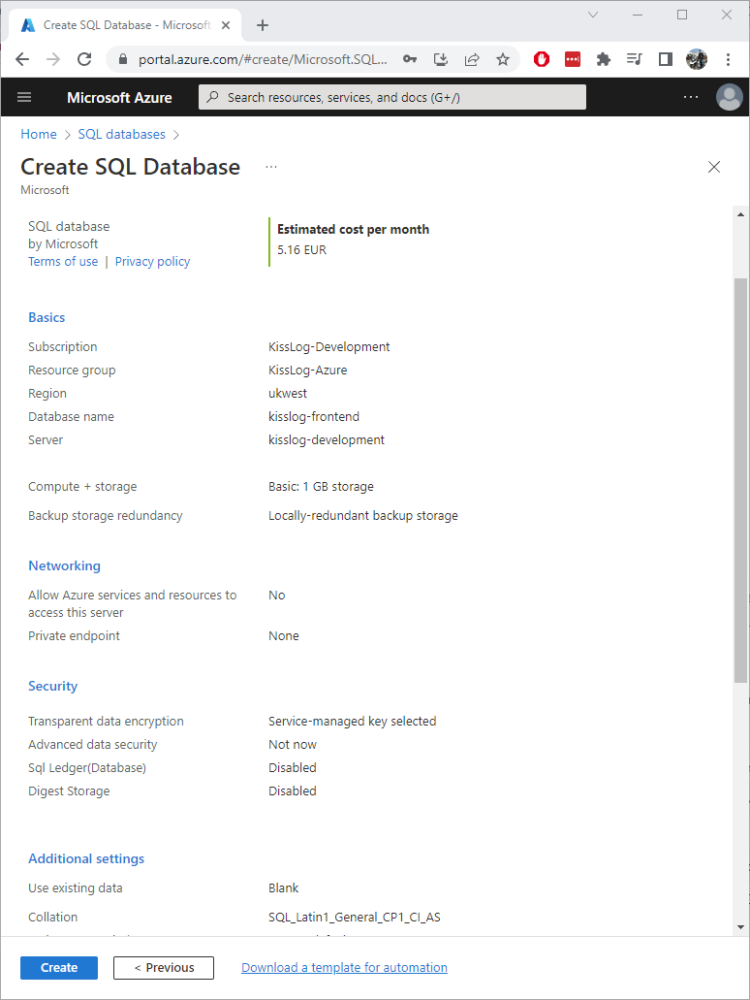

Azure Cosmos DB
~~~~~~~~~~~~~~~~~~~~~

logBee server uses Azure Cosmos DB very intensively. The minimum throughput used by the logBee server (calculated in RU/s) highly depends on the frequency and volume of data you save.

The cost of the Azure Cosmos DB service is influenced by the throughput (RU/s) and by the number of replicas used.

To get started, we will use a single-region `Azure Cosmos DB free tier account <https://learn.microsoft.com/en-us/azure/cosmos-db/free-tier>`_ which covers for free a maximum of 1000 RU/s.

Create an Azure Cosmos DB account. Select **Azure Cosmos DB for NoSQL**.

.. list-table::
   :header-rows: 1

   * - Basics
     - 
   * - Account Name
     - logBee-database-nosql *(or any value)*
   * - Location
     - (Europe) West Europe *<or any appropriate value>*
   * - Capacity mode
     - Provisioned throughput
   * - Apply Free Tier Discount
     - Apply
   * - Limit total account throughput
     - Checked

.. list-table::
   :header-rows: 1

   * - Global Distribution
     - 
   * - Geo-Redundancy
     - Disable
   * - Multi-region Writes
     - Disable
   * - Availability Zones
     - Disable

.. list-table::
   :header-rows: 1

   * - Networking
     - 
   * - Connectivity method
     - All networks

.. list-table::
   :header-rows: 1

   * - Backup Policy
     - 
   * - Backup policy
     - Continuous (7 days) *(available for free)*

.. list-table::
   :header-rows: 1

   * - Encryption
     - 
   * - Data Encryption
     - Service-managed key

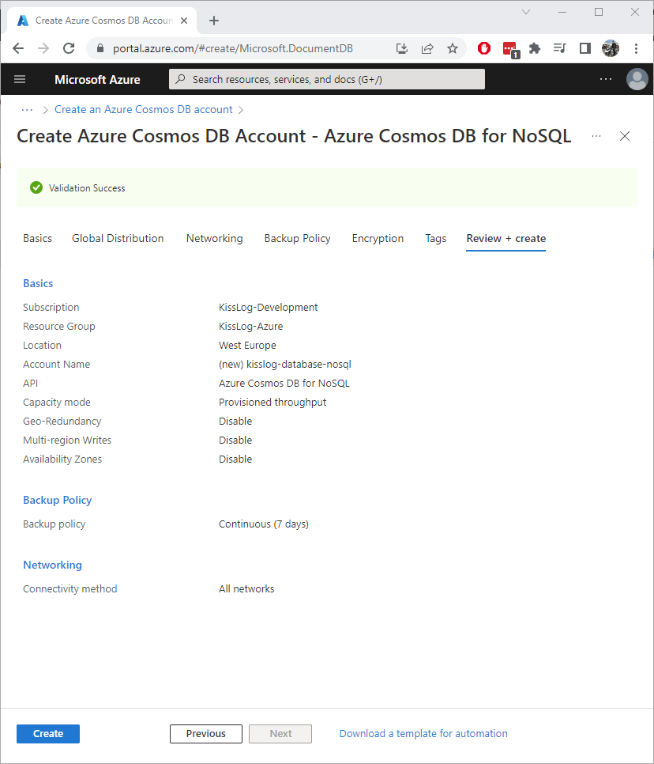

Storage account
~~~~~~~~~~~~~~~~~~~~~~~

logBee server uses Azure storage account for saving blob files and for reducing the workload of Azure Cosmos DB.

1. Create Storage account
^^^^^^^^^^^^^^^^^^^^^^^^^^^^^^^^^^^^^^^^^^^^^^

.. list-table::
   :header-rows: 1

   * - Basics
     - 
   * - Storage account Name
     - logbeestorage *(or any value)*
   * - Region
     - (Europe) West Europe *<or any appropriate value>*
   * - Performance
     - Standard
   * - Redundancy
     - Locally-redundant storage (LRS)

.. list-table::
   :header-rows: 1

   * - Advanced
     - 
   * - Require secure transfer for REST API operations
     - Yes
   * - Allow enabling public access on containers
     - No
   * - Enable storage account key access
     - Yes
   * - Default to Azure Active Directory authorization in the Azure portal
     - No
   * - Minimum TLS version
     - Version 1.2
   * - Access tier
     - Hot

.. list-table::
   :header-rows: 1

   * - Networking
     - 
   * - Network access
     - Enable public access from all networks
   * - Routing preference
     - Microsoft network routing

.. list-table::
   :header-rows: 1

   * - Data protection
     - 
   * - Enable point-in-time restore for containers
     - No
   * - Enable soft delete for blobs
     - No
   * - Enable soft delete for containers
     - No
   * - Enable soft delete for file shares
     - No
   * - Enable versioning for blobs
     - No
   * - Enable blob change feed
     - No
   * - Enable version-level immutability support
     - No

.. list-table::
   :header-rows: 1

   * - Encryption
     - 
   * - Encryption type
     - Microsoft-managed keys (MMK)
   * - Enable support for customer-managed keys
     - Blobs and files only
   * - Enable infrastructure encryption
     - No

.. figure:: images/installation-guide/storage-account-ReviewAndCreate.png
    :alt: Create Storage account

2. Update Lifecycle management
^^^^^^^^^^^^^^^^^^^^^^^^^^^^^^^^^^^^^^^^^^^^^^

After the Storage account has been created, we need to setup a policy to automatically delete old blobs.

On the newly created Storage account dashboard, select the "Lifecycle management" menu from the left, then add a new rule with the following properties:

.. list-table::
   :header-rows: 1

   * - Details
     - 
   * - Rule name
     - deleteAfterExpiryDate
   * - Rule scope
     - Apply rule to all blobs in your storage account
   * - Blob type
     - Block blobs
   * - Blob subtype
     - Base blobs

.. list-table::
   :header-rows: 1

   * - Base blobs
     - 
   * - [If] Base blobs were
     - Created
   * - More than (days ago)
     - 31 *<see the note below>*
   * - Blob type
     - Block blobs
   * - Blob subtype
     - Base blobs
   * - [Then]
     - Delete the blob

.. note::
   The value for **Created more than (days ago)** should be equal to (or slightly bigger) than the maximum TimeToLive property of the Request logs.

App Services
~~~~~~~~~~~~~~~~~~~~~

logBee server uses 2 App Services, one for logBee.Backend application and the second for logBee.Frontend application.

logBee.Backend application is responsible for processing and saving all the logs to Azure Cosmos DB.
This application is CPU intensive (used for serializing/deserialzing the Azure Cosmos DB records), and uses the RAM memory for the internal queuing system.

logBee.Frontend application is lightweight and is only responsible for displaying the user-interface.

In this tutorial we will use for both of the App Services the Free pricing plan.
However, for a reliable performance and user-experience, you should scale up the App Service plans matching your usage needs. 

.. note::
   Hotizontal scaling is not currently supported by logBee server.

   Both logBee.Backend and logBee.Frontend applications must each be deployed to a single instace.

Create App Services
^^^^^^^^^^^^^^^^^^^^^^^^^^^^^^^^^^^^^^^^^^^^^^

We will create two App Services, both with the same configurations:

* logBee-backend
* logBee-frontend

.. list-table::
   :header-rows: 1

   * - Basics
     - 
   * - Name
     - logBee-backend *(or any value)*
   * - Publish
     - Code
   * - Runtime stack
     - .NET 8 (LTS)
   * - Operating System
     - Linux
   * - Region
     - (Europe) West Europe *<or any appropriate value>*
   * - Pricing Plan
     - Free F1 (Shared infrastructure)
   * - Zone redundancy
     - Disabled

.. list-table::
   :header-rows: 1

   * - Deployment
     - 
   * - Continuous deployment
     - Disable

.. list-table::
   :header-rows: 1

   * - Networking
     - 
   * - Enable public access
     - On
   * - Enable network injection
     - Off

.. list-table::
   :header-rows: 1

   * - Monitoring
     - 
   * - Enable Application Insights
     - No

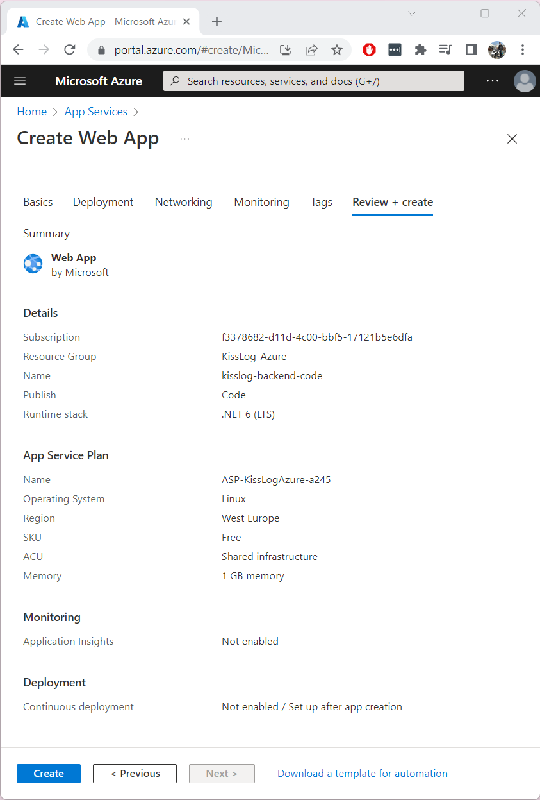

Initial deployment
-------------------------------------------------------

1. Prepare the artifacts
~~~~~~~~~~~~~~~~~~~~~~~~~~~~~~~~~~~~

Extract the logBee server artifact archive in a folder. Then, extract both of the resulting archives in two separate folders: `logBee.Backend` and `logBee.Frontend`.

Update logBee.Backend configuration
^^^^^^^^^^^^^^^^^^^^^^^^^^^^^^^^^^^^^^^^^^^^^^

In the `logBee.Backend` folder, open the configuration file located under ``Configuration\logBee.json`` and update the following properties:

.. list-table::
   :header-rows: 1

   * - Property
     - Value
     - Notes
   * - LogBeeBackendUrl
     - https://logBee-backend.azurewebsites.net
     - "URL" from the `logBee-backend` App Service
   * - LogBeeFrontendUrl
     - https://logBee-frontend.azurewebsites.net
     - "URL" from the `logBee-frontend` App Service
   * - Database.Provider
     - AzureCosmosDb
     - 
   * - Database.AzureCosmosDb.ApplicationRegion
     - West Europe
     - "Write Locations" from the Azure Cosmos DB
   * - Database.AzureCosmosDb.ConnectionString
     - AccountEndpoint=xxx;AccountKey=xxx;
     - "PRIMARY CONNECTION STRING" from the Azure Cosmos DB, "Keys" section
   * - Files.Provider
     - Azure
     -
   * - Files.Azure.ConnectionString
     - DefaultEndpointsProtocol=https;AccountName=xxx;AccountKey=xxx;EndpointSuffix=core.windows.net
     - "Connection string" from the Storage account, "Access keys" section

Update logBee.Frontend configuration
^^^^^^^^^^^^^^^^^^^^^^^^^^^^^^^^^^^^^^^^^^^^^^

In the `logBee.Frontend` folder, open the configuration file located under ``Configuration\logBee.json`` and update the following properties:

.. list-table::
   :header-rows: 1

   * - Property
     - Value
     - Notes
   * - LogBeeBackendUrl
     - https://logBee-backend.azurewebsites.net
     - "URL" from the `logBee-backend` App Service
   * - LogBeeFrontendUrl
     - https://logBee-frontend.azurewebsites.net
     - "URL" from the `logBee-frontend` App Service
   * - Database.Provider
     - SqlServer
     - 
   * - Database.ConnectionString
     - Server=xxx,1433;Initial Catalog=xxx;Persist Security Info=False;User ID={your_user};Password={your_password};
     - "ADO.NET (SQL authentication)" from the SQL Database, "Connection strings" section

2. Update the App Services
~~~~~~~~~~~~~~~~~~~~~~~~~~~~~~~~~~~~

Repeat the steps below for both of the App Services.

Prepare the artifacts
^^^^^^^^^^^^^^^^^^^^^^^^^^^^^^^^^^^^^^^^^^^^^^

Create a ``zip`` archive with the contents of `logBee.Backend` folder.

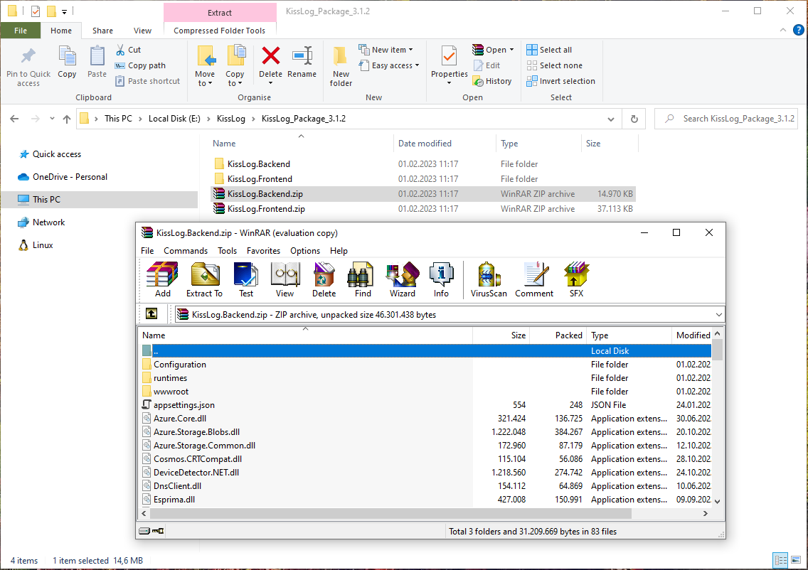

Stop the App Service
^^^^^^^^^^^^^^^^^^^^^^^^^^^^^^^^^^^^^^^^^^^^^^

Make sure the App Service is stopped before uploading the new code.

Upload the artifacts
^^^^^^^^^^^^^^^^^^^^^^^^^^^^^^^^^^^^^^^^^^^^^^

Navigate to logBee.Backend App Service. On top right, click on "Download publish profile" button. Open the downloaded file and copy the ``userName`` and the ``userPWD``.

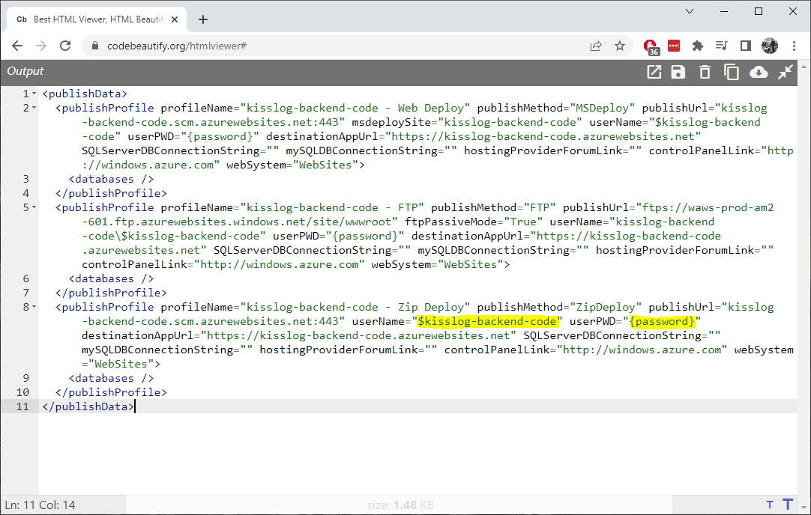

| To deploy the application, send a POST request to :samp:`https://<app_name>.scm.azurewebsites.net/api/zipdeploy`.
| The POST request must contain the .zip file in the message body.
| Set the Basic Authentication header with the Username and Password values copied from the PublishProfile.

.. code-block:: none

   curl -X POST -u $logbee-backend:{password} --data-binary @"<zip_file_path>" https://logBee-backend.scm.azurewebsites.net/api/zipdeploy

If the update was successful, you will receive a ``200 OK`` response status code.

The artifact can also be deployed with Postman.

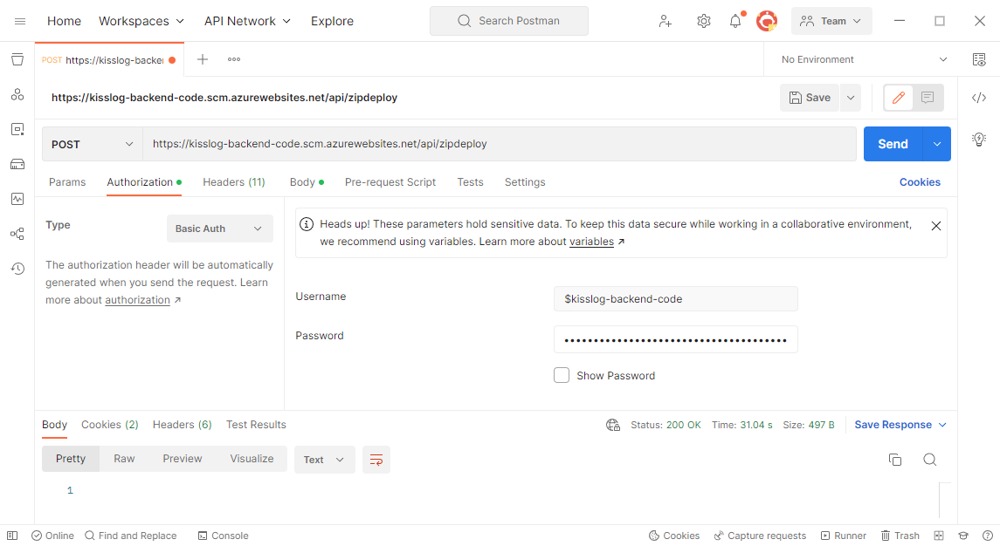

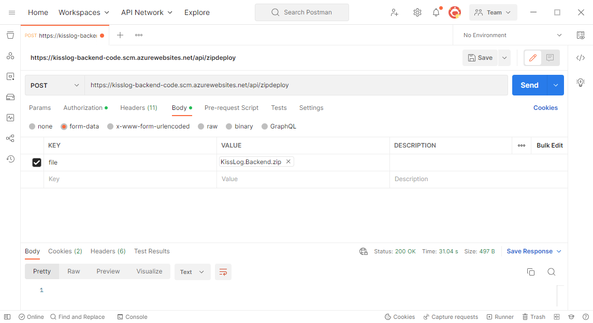

3. Run the logBee.Backend App Service
~~~~~~~~~~~~~~~~~~~~~~~~~~~~~~~~~~~~~~~~~~

After logBee.Backend App Service has been updated, start the App Service then browse to the application URL.

If everything went successful, you will see the logBee.Backend home page.

.. note::
   | The initial startup is time consuming and can take up to a few minutes.
   | During the initial startup, logBee.Backend will also create the Azure Cosmos DB database and the containers.

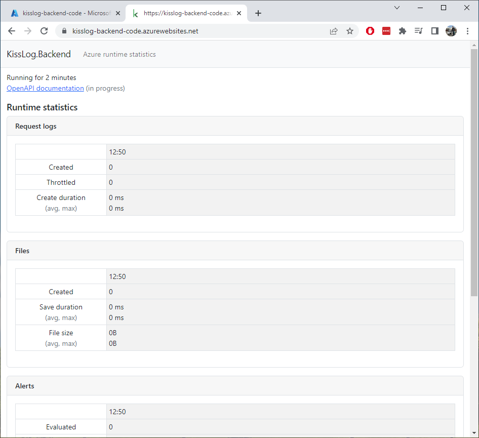

4. Run the logBee.Frontend App Service
~~~~~~~~~~~~~~~~~~~~~~~~~~~~~~~~~~~~~~~~~~

After logBee.Frontend App Service has been updated, start the App Service then browse to the application URL.

If everything went successful, you will see the logBee.Frontend home page.

.. note::
   | The initial startup is time consuming and can take up to a few minutes.
   | During the initial startup, logBee.Frontend will also create the SQL database.

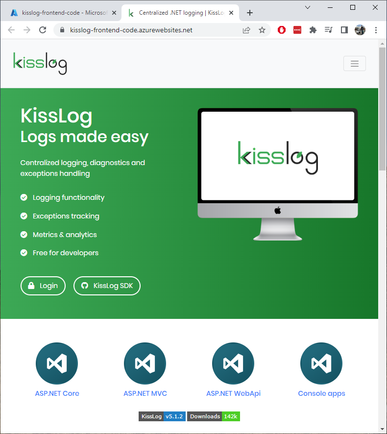

Post deployment
-------------------------------------------------------

Your logBee server is running and ready to process the logs. You can update your dotnet applications to start sending the logs to the newly created logBee.Backend AppService.

Make sure you update the configuration values, respectively the "OrganizationId", "ApplicationId" and "ApiUrl".

.. code-block:: csharp

    KissLogConfiguration.Listeners
        .Add(new RequestLogsApiListener(new Application(Configuration["LogBee.OrganizationId"], Configuration["LogBee.ApplicationId"]))
        {
            ApiUrl = "https://logBee-backend.azurewebsites.net/"
        });

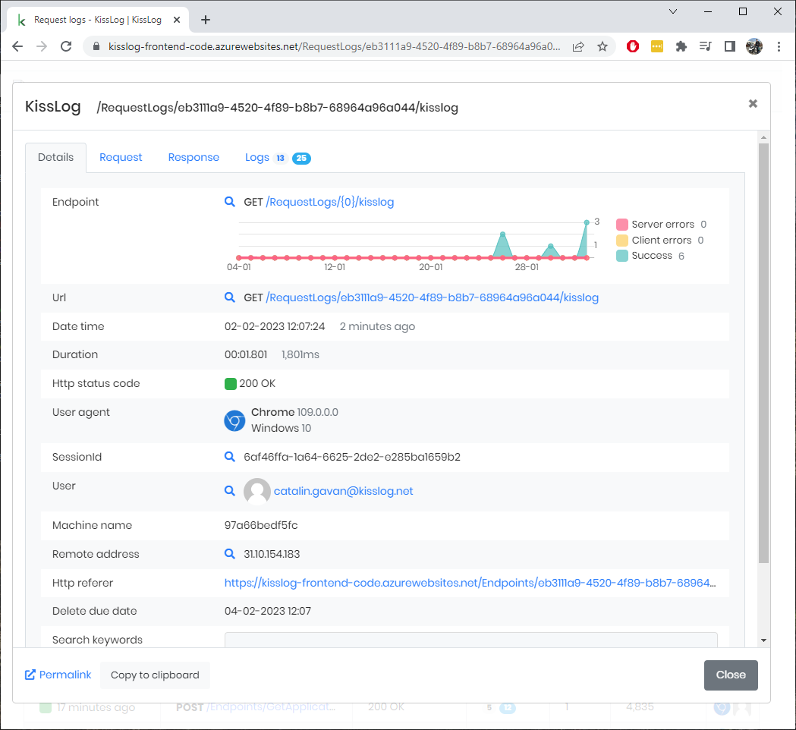

Upgrade the services
-------------------------------------------------------

In this tutorial we have used the low-pricing tier for all the Azure Services that we have created, respectively:

- SQL Database: Basic
- Azure Cosmos DB: 1000 RU/s
- logBee.Backend App Service: Free F1
- logBee.Frontend App Service: Free F1

Although this is enough for the logBee server to start running, the performance and stability of the application is directly affected by the capabilities of the underlying services.

If you experience low performance, you should incrementally scale up the services. The most workload is handled by the Azure Cosmos DB service and by the logBee.Backend App Service, and you can start with them.

.. note::
   Hotizontal scaling is not currently supported by logBee server.

   Both logBee.Backend and logBee.Frontend App Services must each be deployed to a single instace.

Scale up Azure Cosmos DB
~~~~~~~~~~~~~~~~~~~~~~~~~~~~~~~

To scale up the Azure Cosmos DB service, select the "Scale" menu from the left. Increse the Throughput, then click "Save".

.. figure:: images/installation-guide/azure-cosmos-db-scale-up.png
    :alt: Scale up Azure Cosmos DB

Scale up App Service
~~~~~~~~~~~~~~~~~~~~~~~~~~~~~~~

To scale up the App Service, select the "Scale up (App Service plan)" menu from the left. Choose a new Plan. Click "Select" to apply.

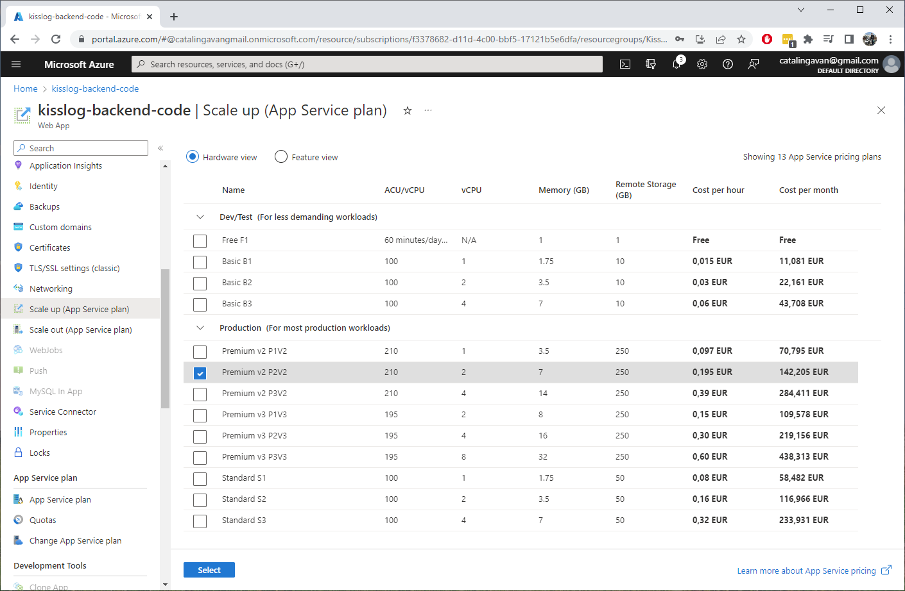