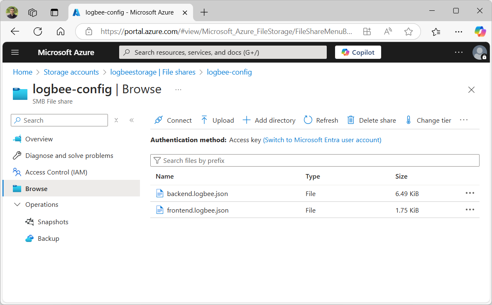

Installation guide
=============================

.. contents:: Table of contents
   :local:

|ico2| This tutorial will guide you through the installation steps for Logbee in Microsoft Azure.

.. |ico2| image:: images/azure-logo.png
   :height: 32px

Installing Prerequisites
-------------------------------------------------------

Azure Cosmos DB
~~~~~~~~~~~~~~~~~~~~~

Create an Azure Cosmos DB account. Select **Azure Cosmos DB for NoSQL**.

.. list-table::
   :header-rows: 1

   * - Properties
     - 
   * - Account Name
     - logbee-cosmosdb *(or any value)*
   * - Availability Zones
     - Disable
   * - Location
     - (Europe) West Europe *(or any appropriate value)*
   * - Capacity mode
     - Provisioned throughput
   * - Apply Free Tier Discount
     - Apply
   * - Limit total account throughput
     - Checked
   * - Geo-Redundancy
     - Disable
   * - Multi-region Writes
     - Disable
   * - Connectivity method
     - All networks
   * - Backup policy
     - Continuous (7 days) *(available for free)*
   * - Data Encryption
     - Service-managed key

🗒️ Once the Azure Cosmos DB account has been created, navigate to **Settings > Keys** and copy the "PRIMARY CONNECTION STRING" to a text editor.

.. figure:: images/azure-cosmos-db-connection-string.png
    :alt: Azure Cosmos DB Connection String

Storage account
~~~~~~~~~~~~~~~~~~~~~

Logbee uses Azure storage account for saving blob files and for reducing the workload of Azure Cosmos DB.

Create a storage account with the following properties:

.. list-table::
   :header-rows: 1

   * - Properties
     - 
   * - Storage account name
     - logbeestorage *(or any value)*
   * - Region
     - (Europe) West Europe *(or any appropriate value)*
   * - Primary service
     - Azure Blob Storage or Azure Data Lake Storage Gen 2
   * - Performance
     - Standard
   * - Redundancy
     - Locally-redundant storage (LRS)
   * - Access tier
     - Hot
   * - Public network access
     - Enable
   * - Public network access scope
     - Enable from all networks
   * - Encryption type
     - Microsoft-managed keys (MMK)

🗒️ Once the Storage account has been created, navigate to **Security & networking > Access keys** and copy the "Connection string" to a text editor.

Navigate to **Data storage > File shares** and create a new File share.

.. list-table::
   :header-rows: 1

   * - Properties
     - 
   * - Name
     - logbee-config
   * - Access tier
     - Transaction optimized
   * - Enable backup
     - Unchecked

Navigate to **Data management > Lifecycle management** and create a new Rule.

.. list-table::
   :header-rows: 1

   * - Properties
     - 
   * - Rule name
     - DeleteLogbeeBlobs
   * - Rule scope
     - Apply rule to all blobs in your storage account
   * - Blob type
     - Block blobs
   * - Blob subtype
     - Base blobs

Under **Base blobs** tab, update the condition as following:

.. list-table::
   :header-rows: 1

   * - Base blobs
     - 
   * - Base blobs were
     - Last modified
   * - More than (days ago)
     - 60 (see note below)
   * - Then
     - Delete the blob

.. note::
   | Logbee uses Azure Blob Storage for saving Azure Cosmos DB payloads, which helps reducing the Azure Cosmos DB workload.
   | The value for the **More than (days ago)** property should be equal to (or slightly higher) than the maximum retention period specified under the :ref:`TimeToLive <on-premises/logbee-backend/configuration:TimeToLive>` configuration.

Logbee.Backend Web App Service 
~~~~~~~~~~~~~~~~~~~~~~~~~~~~~~~~~~~~~~~

Create a App Service Web App with the following properties:

.. list-table::
   :header-rows: 1

   * - Properties
     - 
   * - Name
     - logbee-backend (or any appropriate value)
   * - Publish
     - Container
   * - Operating System
     - Linux
   * - Region
     - West Europe (or any appropriate value)
   * - Pricing plan
     - Basic B3 (see `scaling up the services <#scaling-up-the-services>`_)
   * - Image Source
     - Quickstart (we will change this after the resource is created)

After creating the App Service, go to **Overview** menu and click "Browse".
If everything went ok, you should see a successful web page.

🗒️ Copy the value of the URL in a text file. The URL should be a value looking like this: ``https://{app-service-name}.azurewebsites.net/``

Logbee.Frontend Web App Service 
~~~~~~~~~~~~~~~~~~~~~~~~~~~~~~~~~~~~~~~

Create a Web App App Service with the following properties:

.. list-table::
   :header-rows: 1

   * - Properties
     - 
   * - Name
     - logbee-frontend (or any appropriate value)
   * - Publish
     - Container
   * - Operating System
     - Linux
   * - Region
     - West Europe (or any appropriate value)
   * - Pricing plan
     - Basic B2 (see `scaling up the services <#scaling-up-the-services>`_)
   * - Image Source
     - Quickstart (we will change this after the resource is created)

After creating the App Service, go to **Overview** menu and click "Browse".
If everything went ok, you should see a successful web page.

🗒️ Copy the value of the URL in a text file. The URL should be a value looking like this: ``https://{app-service-name}.azurewebsites.net/``

Prepare the configuration files
-------------------------------------------------------

\1. Download the configuration files for both Logbee.Frontend and Logbee.Backend and save them locally:

- `backend.logbee.json <https://github.com/catalingavan/logbee-app/blob/main/logbee.Backend/logbee.json>`_

- `frontend.logbee.json <https://github.com/catalingavan/logbee-app/blob/main/logbee.Frontend/logbee.json>`_

.. code-block:: none

    /logbee-config
    ├── backend.logbee.json
    └── frontend.logbee.json

\2. Update the **backend.logbee.json** configuration file with the keys from the recently created azure services:

.. code-block:: json
    
    {
        "LogbeeFrontendConfigurationFilePath": "configuration/frontend.logbee.json",
        "LogbeeBackendUrl": "<Logbee Backend App Service URL>",
        "Database": {
            "Provider": "AzureCosmosDb",
            "AzureCosmosDb": {
                "ApplicationRegion": "West Europe <"Write Locations" from Azure Cosmos DB>",
                "ConnectionString": "<Azure Cosmos DB Connection string>",
                "DatabaseName": "logbee-backend",
                "AzureStorageAccountConnectionString": "<Storage account Connection string>"
            }
        },
        "FileStorage": {
            "Provider": "Azure",
            "Azure": {
                "ConnectionString": "<Storage account Connection string>"
            }
        }
    }

- **LogbeeBackendUrl** must be updated with the Logbee.Backend App Service URL.

- **Database.AzureCosmosDb.ApplicationRegion** must be updated with the region name where the Azure Cosmos DB has been created.

\3. Update the **frontend.logbee.json** configuration file:

.. code-block:: json
    
    {
      "LogbeeBackendConfigurationFilePath": "configuration/backend.logbee.json",
      "LogbeeFrontendUrl": "<Logbee Frontend App Service URL>",
      "Database": {
        "Provider": "AzureCosmosDb",
        "AzureCosmosDb": {
          "ConnectionString": "<Azure Cosmos DB Connection string>",
          "ApplicationRegion": "West Europe <"Write Locations" from Azure Cosmos DB>",
          "DatabaseName": "logbee-frontend",
          "AzureStorageAccountConnectionString": "<Storage account Connection string>"
        }
      }
    }

- **LogbeeFrontendUrl** must be updated with the Logbee.Frontend App Service URL.

- **Database.AzureCosmosDb.ApplicationRegion** must be updated with the region name where the Azure Cosmos DB has been created.

Upload the configuration files
-------------------------------------------------------

Navigate to the recently created Storage account and go to **Data storage > File shares** menu.

Select the ``logbee-config`` file share and upload the two configuration files.

Configure Logbee.Backend App Service
-------------------------------------------------------

Create Azure  Storage Mount
~~~~~~~~~~~~~~~~~~~~~~~~~~~~~~~~~~~~~~~

On the Logbee.Backend App Service, navigate to **Settings > Configuration**, select the **Path mappings** tab and click the **New Azure Storage Mount** button.

Create a new Azure Storage Mount with the following properties:

.. list-table::
   :header-rows: 1

   * - Properties
     - 
   * - Name
     - **config-mount**
   * - Configuration options
     - Basic
   * - Storage accounts
     - **logbeestorage** (select the value from the dropdown list)
   * - Storage type
     - Azure Files
   * - Protocol
     - SMB
   * - Storage container
     - **logbee-config** (select the value from the dropdown list)
   * - Mount path
     - **/configuration**

Once the Azure Storage mount has been created, click the **Save** button (the App Service will restart).

By adding the Azure Storage Mount, we can now inject the recently uploaded configuration files in the App Service container.

Enable App Service logs
~~~~~~~~~~~~~~~~~~~~~~~~~~~~~~~~~~~~~~~

Enabling App Service logs will expose the container logs to the host application, allowing for easier troubleshooting issues.

On the Logbee.Backend App Service, navigate to **Monitoring > App Service logs** and update the following properties:

.. list-table::
   :header-rows: 1

   * - Properties
     - 
   * - Application logging
     - File System
   * - Quota (MB)
     - 35
   * - Retention Period (Days)
     - 1

Click the **Save** button.

Update the container configuration
~~~~~~~~~~~~~~~~~~~~~~~~~~~~~~~~~~~~~~~

On the Logbee.Backend App Service, navigate to **Deployment > Deployment Center** and select the **Settings** tab.

Update the following properties:

.. list-table::
   :header-rows: 1

   * - Properties
     - 
   * - Source
     - Container Registry
   * - Container type
     - Docker Compose (Preview)
   * - Registry source
     - Docker Hub
   * - Repository Access
     - Public

Set the **Config** textarea to the following:

.. code-block:: yaml
    
    version: "3.7"
    services:
      backend:
        image: catalingavan/logbee.backend:2.0.0
        init: true
        restart: unless-stopped
        volumes:
          - config-mount:/app/configuration
        environment:
          - ASPNETCORE_URLS=http://0.0.0.0:80
          - LOGBEE_BACKEND_CONFIGURATION_FILE_PATH=configuration/backend.logbee.json
        ports:
          - "44080:80"

Click the **Save** button and **restart** the App Service for the new changes to be refected.

Once the App Service has been restarted, Logbee.Backend should now be running:

.. figure:: images/logbee-backend-app-service-running.png
    :alt: Logbee.Backend App Service running

Configure Logbee.Frontend App Service
-------------------------------------------------------

For Logbee.Frontend, follow the same steps as for Logbee.Backend, with the exception of:

Under **Deployment > Deployment Center** menu, **Settings** tab, update the **Config** to the following:

.. code-block:: yaml

   version: "3.7"
   services:
    frontend:
      image: catalingavan/logbee.frontend:2.0.0
      init: true
      restart: unless-stopped
      volumes:
       - config-mount:/app/configuration
      environment:
       - ASPNETCORE_URLS=http://0.0.0.0:80
       - LOGBEE_FRONTEND_CONFIGURATION_FILE_PATH=configuration/frontend.logbee.json
      ports:
       - "44080:80"

Once the App Service has been restarted, you should now see the Logbee.Frontend application running:

You can follow the :ref:`Authentication <on-premises/logbee-frontend/index:Authentication>` instructions for generating an authentication token.

If you are using the default ``HS256Secret`` value, you can use the following authentication token:

.. code-block:: none

   eyJhbGciOiJIUzI1NiIsInR5cCI6IkpXVCJ9.e30.HP79qro7bvfH7BneUy5jB9Owc_5D2UavFDulRETAl9E

Troubleshooting
-------------------------------------------------------

If something does not work as expected, you should find useful information under the App Service logs.

Under the App Service, navigate to **Deployment > Deployment Center** and select the **Logs** tab.

Any errors, such as configuration errors or Azure CosmosDB connection issues will be displayed here.

Please don't hesitate to contact us if you need help with the installation process.

Scaling Up the Services
-------------------------------------------------------

In this tutorial, we have used the following configurations:

- **Azure Cosmos DB** with **Provisioned throughput** and **Free Tier** enabled.
- **Logbee.Backend App Service** with **Basic B3** pricing plan
- **Logbee.Frontend App Service** with **Basic B2** pricing plan

While these settings allow Logbee to run successfully, the application's performance and stability depend on the capacity of the underlying services.

- **Logbee.Backend App Service** handles most of the heavy processing, as it ingests and processes all incoming logs.
- **Logbee.Frontend App Service** has a lighter workload, mainly responsible for displaying data.
- **Azure Cosmos DB** is intensively used for storing and retrieving log data.

If you experience performance issues, consider incrementally scaling up these services.
Start by increasing the capacity of **Azure Cosmos DB** and the **Logbee.Backend App Service**, as they handle the most workload.
