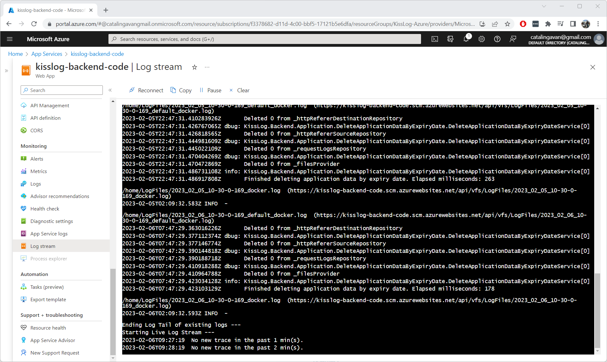
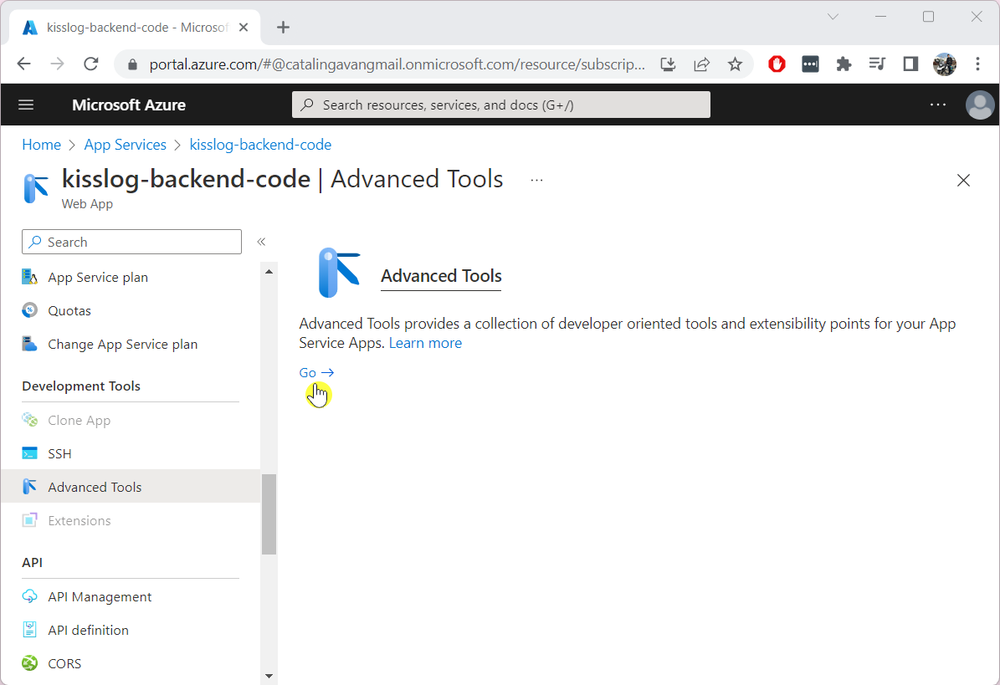
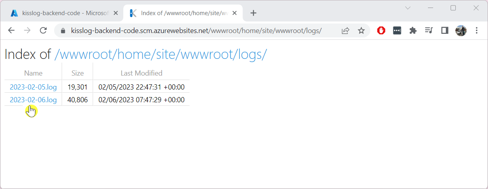
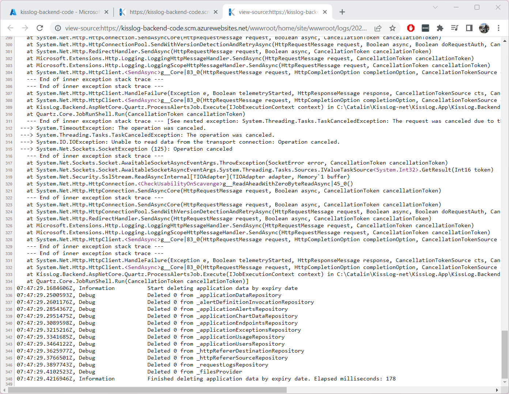

Troubleshooting
=============================

.. contents:: Table of contents
   :local:

Some of the common reasons for which the logBee server can fail to run include:

- ``Configuration\logbee.json`` configuration errors
- Services connectivity errors (such as SQL, Azure Cosmos DB, Storage accounts)
- SQL permissions errors

Checklist
-------------------------------------------------------

App Service Log stream
~~~~~~~~~~~~~~~~~~~~~~~~~~~~

If an App Service fails to run, the first step is to check the App Service Log stream.

Application logs
~~~~~~~~~~~~~~~~~~~~~~~~~~~~

Both App Services save their internal logs under ``home/site/wwwroot/logs`` folder.

To access the internal logs, navigate on the App Service overview page. On the left menu, under "Development Tools", click on the "Advanced Tools", then click on the "Go" link. This will open the Azure Kudu service.

Once on the Kudu service, navigate to the application files by clicking on "Site wwwroot" link.

.. figure:: images/update-guide/kisslog-backend-kudu-service.png
    :alt: Kudu Service

Need help?
-------------------------------------------------------

Open a `GitHub issue <https://github.com/catalingavan/logbee-app/issues>`_ or send an email to catalingavan@gmail.com.