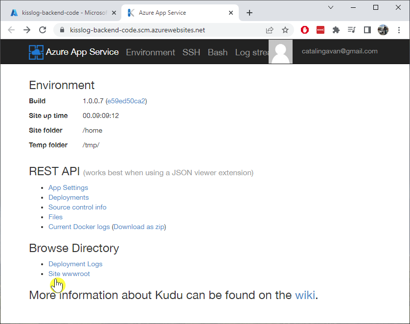

Update guide
=============================

.. contents:: Table of contents
   :local:

Prerequisites
-------------------------------------------------------

Artifacts
~~~~~~~~~~~~~~~~~~~~~~~

- logBee.Backend-{version}-linux-x64.zip
- logBee.Frontend-{version}-linux-x64.zip

Artifacts can be downloaded from `https://github.com/logBee-net/logBee-app <https://github.com/logBee-net/logBee-app>`_.

Update the applications
-------------------------------------------------------

Repeat the steps below for both of the App Services. Start with logBee.Backend followed by logBee.Frontend.

1. Download the existing configuration file
~~~~~~~~~~~~~~~~~~~~~~~~~~~~~~~~~~~~~~~~~~~~~~

Navigate on the App Service overview page. On the left menu under "Development Tools", click on the "Advanced Tools", then click on the "Go" link. This will open the Azure Kudu service.

Once on the Kudu service, navigate to the application files by clicking on "Site wwwroot" link.

The configuration file is located under ``Configuration/logBee.json``. Copy this file locally.

.. figure:: images/update-guide/kisslog-backend-configuration-file.png
    :alt: Configuration file

2. Update the configuration file
~~~~~~~~~~~~~~~~~~~~~~~~~~~~~~~~~~~~~~~~~~~~~~

Apply the configuration changes (if any) by updating logBee.json file.

The configuration changes will be listed in the :doc:`change log </on-premises/logBee-backend/change-log>`.

3. Prepare the artifacts
~~~~~~~~~~~~~~~~~~~~~~~~~~~~~~~~~~~~~~~~~~~~~~

Extract the LogBee server artifact archive in a folder. Then, extract both of the resulting archives in two separate folders: `logBee.Backend` and `logBee.Frontend`.

Replace the ``logBee.Backend\Configuration\logBee.json`` with the existing configuration file.

Create a ``zip`` archive with the contents of the `logBee.Backend` folder.

4. Upload the new code
~~~~~~~~~~~~~~~~~~~~~~~~~~~~~~~~~~~~~~~~~~~~~~

Make sure the App Service is stopped before uploading the new code.

Navigate to logBee.Backend App Service. On top right, click on "Download publish profile" button. Open the downloaded file and copy the ``userName`` and the ``userPWD``.

.. figure:: images/installation-guide/publish-profile.png
    :alt: logBee.Backend artifact

| To deploy the application, send a POST request to :samp:`https://<app_name>.scm.azurewebsites.net/api/zipdeploy`.
| The POST request must contain the .zip file in the message body.
| Set the Basic Authentication header with the Username and Password values copied from the PublishProfile.

.. code-block:: none

   curl -X POST -u $logBee-backend:{password} --data-binary @"<zip_file_path>" https://logBee-backend.scm.azurewebsites.net/api/zipdeploy

If the update was successful, you will receive a ``200 OK`` response status code.

The new code can also be deployed with Postman.

.. figure:: images/installation-guide/postman-zipdeploy-authorization.png
    :alt: Postman Authorization

.. figure:: images/installation-guide/postman-zipdeploy-response.png
    :alt: Uploading logBee.Backend code

5. Run the logBee.Backend App Service
~~~~~~~~~~~~~~~~~~~~~~~~~~~~~~~~~~~~~~~~~~

After logBee.Backend App Service has been updated, start the App Service then browse to the application URL.

If everything went successful, you will see the logBee.Backend home page.

.. note::
   | The initial startup is time consuming and can take up to a few minutes.

.. figure:: images/installation-guide/kisslog-backend-running.png
    :alt: logBee.Backend home page

6. Repeat the steps above for logBee.Frontend
~~~~~~~~~~~~~~~~~~~~~~~~~~~~~~~~~~~~~~~~~~~~~~~~~~~~

Repeat the steps above for the logBee.Frontend App Service, starting with step 1.
