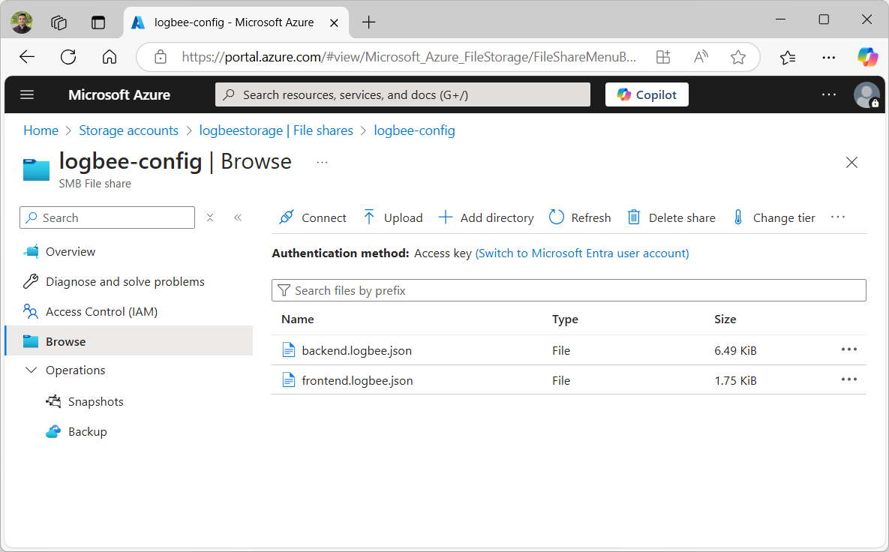
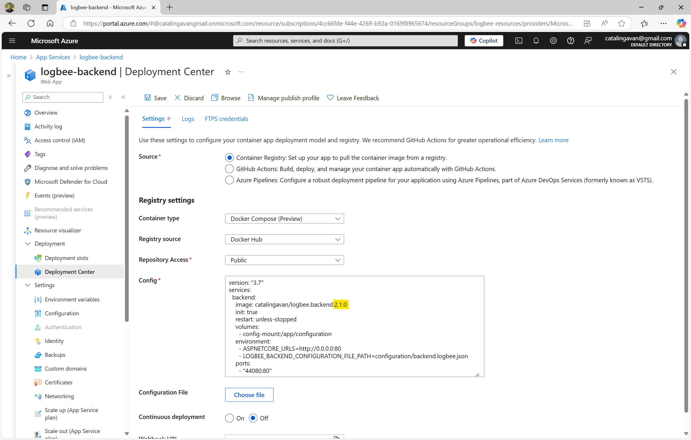

Update guide
========================

.. contents:: Table of contents
   :local:

Since Logbee uses a containerized architecture, the update process is straightforward.

Stop the App Services
-------------------------------------------------------

Stop both of the App Services to avoid conflicts during the update process.

Download existing configuration
-------------------------------------------------------

Under the Azure Storage account, go to the **logbee-config** File share and download the existing configuration files.

.. code-block:: none

    /logbee-config
    ├── backend.logbee.json
    └── frontend.logbee.json

Apply configuration changes
-------------------------------------------------------

Update the **backend.logbee.json** file by applying the configuration changes (if any).

The configuration changes will be listed in the :doc:`Logbee.Backend change log </on-premises/logbee-backend/change-log>`.

Update the **frontend.logbee.json** file by applying the configuration changes (if any).

The configuration changes will be listed in the :doc:`Logbee.Frontend change log </on-premises/logbee-frontend/change-log>`.

Regardless of whether there are any changes for Logbee.Frontend, you need to increment the value of the ``"StaticResourcesVersion"`` property in the **frontend.logbee.json** file.

.. code-block:: json
    
    {
      "StaticResourcesVersion": "2.0.1"
    }

This change ensures that browsers fetch the latest static resources, avoiding issues caused by cached files.

Upload the configuration files
-------------------------------------------------------

Upload the updated configuration files to the **logbee-config** File share.

Update the containers configuration
-------------------------------------------------------

Navigate to the Logbee.Backend App Service and open **Deployment > Deployment Center**.

Update the container **Config** by changing the image tag to the latest version.

The latest versions of the Docker container images can be found at https://github.com/catalingavan/logbee-app?tab=readme-ov-file#latest-versions.

Repeat the same steps for the Logbee.Frontend App Service.

Start the App Services
-------------------------------------------------------

Start the App Services in the following order:

1. Start the **Logbee.Backend App Service**.

2. Start the **Logbee.Frontend App Service**.
