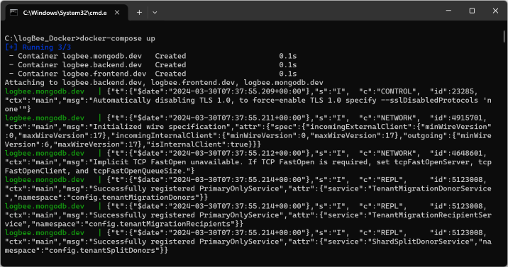
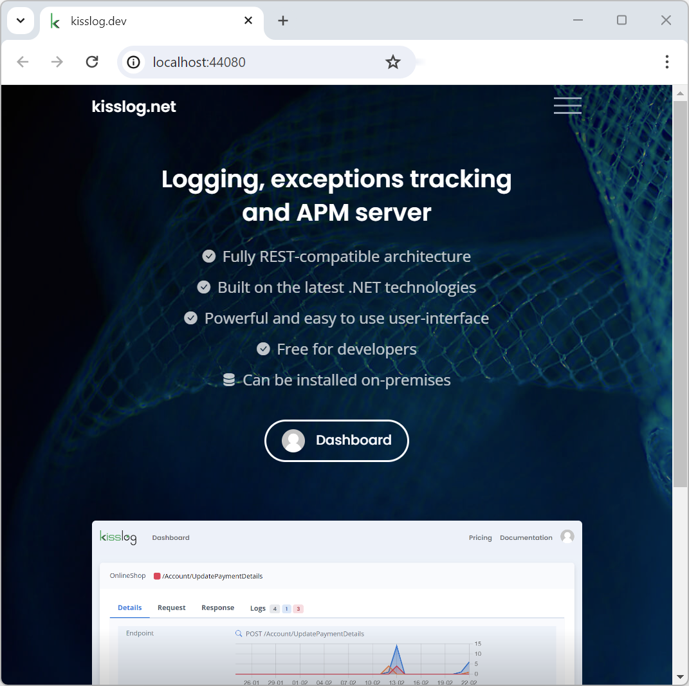
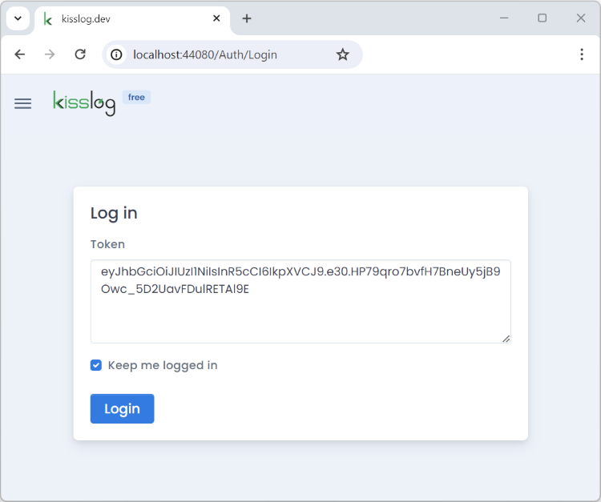
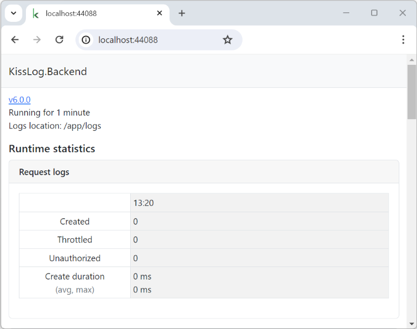
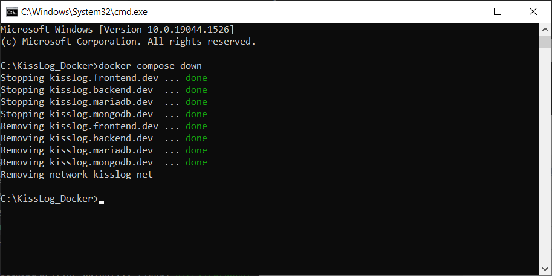

Docker
=============================

logBee can be run as a Docker application, thanks to `Marcio <https://github.com/zimbres>`_ valuable contribution.

The official logBee Docker repositories are the following:

- https://hub.docker.com/r/catalingavan/logBee.backend

- https://hub.docker.com/r/catalingavan/logBee.frontend

Running logBee as a Docker application will automatically install all the necessary prerequisites.

.. contents:: Table of contents
   :local:

Docker files
-------------------------------------------------------

To get started running logBee as a Docker application, create the following files:

.. code-block:: none

    /logBee_Docker
    ├── docker-compose.yml
    ├── backend.appsettings.json
    ├── backend.logBee.json
    ├── frontend.appsettings.json
    └── frontend.logBee.json

.. admonition:: Download Docker files
   :class: note

   Full working example of the files above can be found on `https://github.com/KissLog-net/KissLog-server <https://github.com/KissLog-net/KissLog-server/tree/main/Docker>`_.

.. code-block:: none
    :caption: docker-compose.yml

    version: "3.7"
    networks:
      default:
        name: logBee-net
        driver_opts:
          com.docker.network.driver.mtu: 1380
    
    services:
      backend:
        image: catalingavan/logBee.backend:6.0.0
        container_name: logBee.backend.dev
        restart: unless-stopped
        volumes:
          - ./backend.appsettings.json:/app/appsettings.json
          - ./backend.logBee.json:/app/Configuration/logBee.json
        ports:
          - "44088:80"
        links:
          - "mongodb"
    
      frontend:
        image: catalingavan/logBee.frontend:6.0.0
        container_name: logBee.frontend.dev
        restart: unless-stopped
        volumes:
          - ./frontend.appsettings.json:/app/appsettings.json
          - ./frontend.logBee.json:/app/Configuration/logBee.json
        ports:
          - "44080:80"
        links:
          - "backend"
    
      mongodb:
        image: mongo:6.0.4
        container_name: logBee.mongodb.dev
        restart: unless-stopped
        volumes:
          - mongo-data:/data/db
          - mongo-config:/data/configdb
    
    volumes:
      mongo-data:
      mongo-config:

Build
-------------------------------------------------------

To start the logBee server and all the necessary prerequisites, use ``docker-compose up`` command.

.. code-block:: none

    C:\logBee_Docker> docker-compose up

After all the services have been created, you can access the applications on the following urls:

- logBee.Frontend: http://localhost:44080/
- logBee.Backend: http://localhost:44088/

To authenticate, use the following token:

.. code-block:: none

   eyJhbGciOiJIUzI1NiIsInR5cCI6IkpXVCJ9.e30.HP79qro7bvfH7BneUy5jB9Owc_5D2UavFDulRETAl9E

Destroy
----------------------------

.. code-block:: none

    C:\logBee_Docker> docker-compose down

