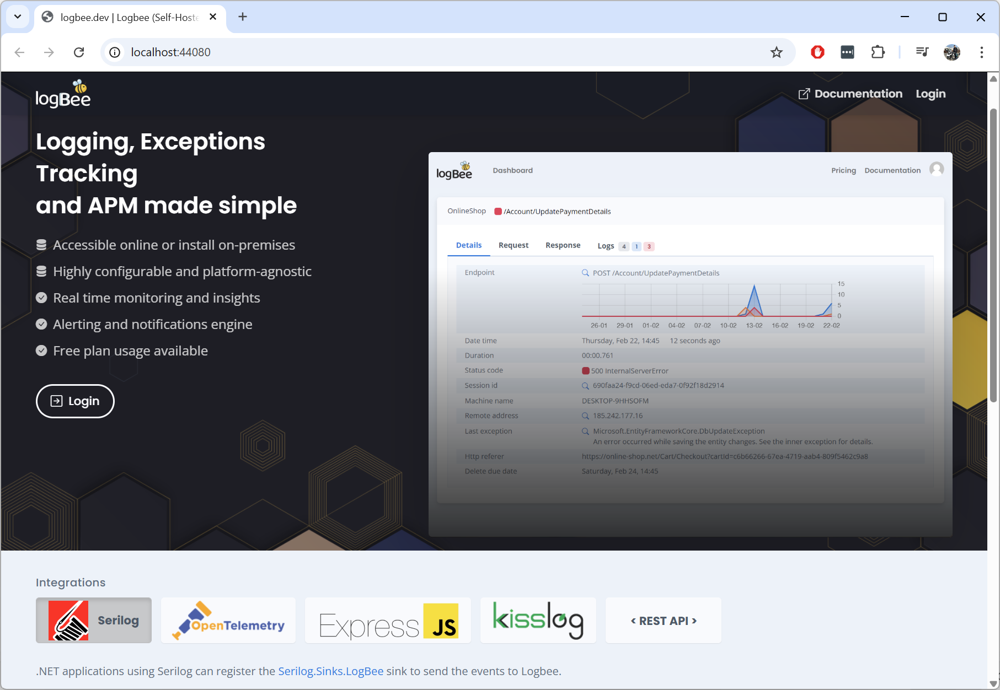
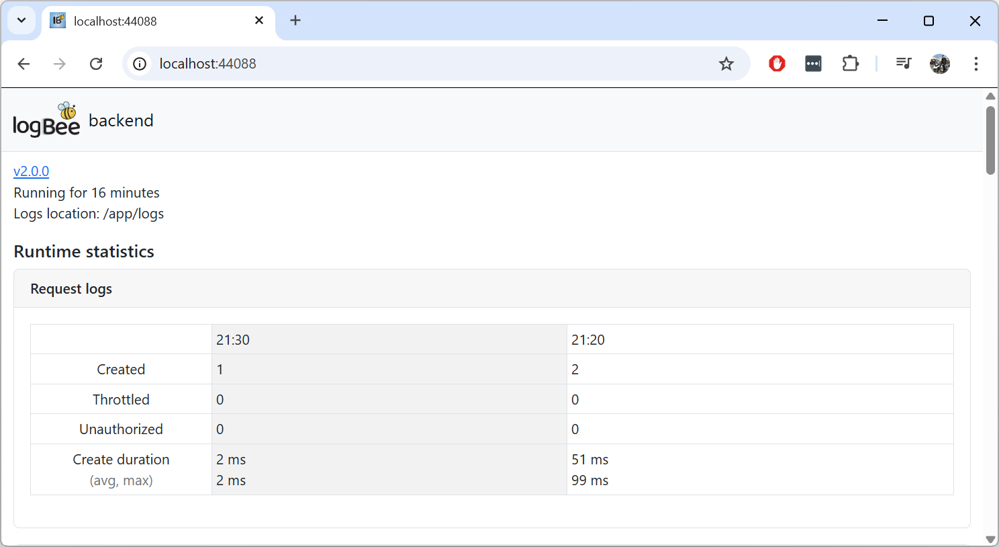

Docker
=============================

Logbee can run as a Docker application, thanks to `Marcio <https://github.com/zimbres>`_ valuable contribution.

The official Logbee Docker images are:

- `catalingavan/logbee.backend <https://hub.docker.com/r/catalingavan/logbee.backend>`_

- `catalingavan/logbee.frontend <https://hub.docker.com/r/catalingavan/logbee.frontend>`_

Running Logbee in Docker will automatically install all the necessary prerequisites.

.. contents:: Table of contents
   :local:

Docker files
-------------------------------------------------------

To get started running Logbee as a Docker container, create the following files:

.. code-block:: none

    /logbee-app/Docker
    ├── docker-compose.yml
    ├── backend.logbee.json
    └── frontend.logbee.json

A full working example for the Logbee docker configuration files can be found on https://github.com/catalingavan/logbee-app/tree/main/Docker.

The latest versions for the Docker container images can be found on https://github.com/catalingavan/logbee-app?tab=readme-ov-file#latest-versions.

.. code-block:: none
    :caption: docker-compose.yml

    networks:
      default:
        name: logbee-net
        driver: bridge
        driver_opts:
          com.docker.network.driver.mtu: 1380

    services:
      backend:
        image: catalingavan/logbee.backend:2.0.0
        container_name: logbee.backend
        restart: unless-stopped
        environment:
          - ASPNETCORE_URLS=http://0.0.0.0:80
          - LOGBEE_BACKEND_CONFIGURATION_FILE_PATH=Configuration/backend.logbee.json
        volumes:
          - ./backend.logbee.json:/app/Configuration/backend.logbee.json
          - ./frontend.logbee.json:/app/Configuration/frontend.logbee.json
        ports:
          - "44088:80"
        depends_on:
          - mongodb
        networks:
          - default

      frontend:
        image: catalingavan/logbee.frontend:2.0.0
        container_name: logbee.frontend
        restart: unless-stopped
        environment:
          - ASPNETCORE_URLS=http://0.0.0.0:80
          - LOGBEE_FRONTEND_CONFIGURATION_FILE_PATH=Configuration/frontend.logbee.json
        volumes:
          - ./frontend.logbee.json:/app/Configuration/frontend.logbee.json
          - ./backend.logbee.json:/app/Configuration/backend.logbee.json
        ports:
          - "44080:80"
        depends_on:
          - backend
        networks:
          - default

      mongodb:
        image: mongo:8.0.4
        container_name: logbee.mongodb
        restart: unless-stopped
        volumes:
          - mongo-data:/data/db
          - mongo-config:/data/configdb
        networks:
          - default

    volumes:
      mongo-data:
      mongo-config:

Build
-------------------------------------------------------

To start the Logbee containers and all the necessary prerequisites, use ``docker compose up -d`` command.

.. code-block:: none

    C:\logbee-app\Docker> docker compose up -d

.. figure:: images/docker-compose-up.png
   :alt: docker compose up

After all the services have been created, you can access the applications using the following URLs:

**Logbee.Frontend**: http://localhost:44080/

**Logbee.Backend**: http://localhost:44088/

You can follow the :ref:`Authentication <on-premises/logbee-frontend/index:Authentication>` instructions for generating an authentication token.

If you are using the default ``HS256Secret`` value, you can use the following authentication token:

.. code-block:: none

   eyJhbGciOiJIUzI1NiIsInR5cCI6IkpXVCJ9.e30.HP79qro7bvfH7BneUy5jB9Owc_5D2UavFDulRETAl9E
  
