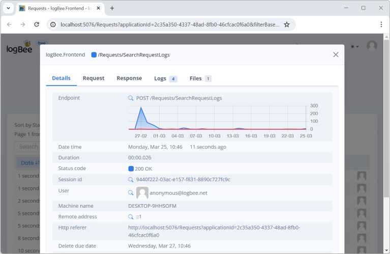

Installation guide
=============================

.. contents:: Table of contents
   :local:

Prerequisites
-------------------------------------------------------

Artifacts
~~~~~~~~~~~~~~~~~~~~~

- logBee.Backend-{version}-win-x64.zip
- logBee.Frontend-{version}-win-x64.zip

Artifacts can be downloaded from `https://github.com/KissLog-net/KissLog-server <https://github.com/KissLog-net/KissLog-server>`_.

Services
~~~~~~~~~~~~~~~~~~~~~

- IIS Web server with `ASP.NET Core Runtime 6 <https://dotnet.microsoft.com/en-us/download/dotnet/6.0>`_ installed

- `MongoDB Community Server <https://www.mongodb.com/try/download/community>`_ (version >= 6.0.x)

Installation
-------------------------------------------------------

MongoDB
~~~~~~~~~~~~~~~~~~~~~

For instructions installing MongoDB server, please check the `official tutorial <https://docs.mongodb.com/manual/tutorial/install-mongodb-on-windows/>`_.

IIS web applications
~~~~~~~~~~~~~~~~~~~~~~~~~~~~~~~~~~~~~~~~~~

1) On the machine hosting the IIS server, install `ASP.NET Core Runtime 6 <https://dotnet.microsoft.com/en-us/download/dotnet/6.0>`_.

2) Create two IIS applications:

   * logBee.Backend
   * logBee.Frontend

3) Update the Application Pool settings for both of the applications to the following:

.. list-table::
   :header-rows: 1

   * - logBee.Frontend
     - logBee.Backend
   * - .. image:: images/installation-guide/logBee.Frontend-ApplicationPool.png
         :alt: logBee.Frontend Application Pool
     - .. image:: images/installation-guide/logBee.Backend-ApplicationPool.png
         :alt: logBee.Backend Application Pool

4) Copy into each IIS application folder the corresponding deploy package

.. list-table::
   :header-rows: 1

   * - logBee.Frontend
     - logBee.Backend
   * - C:\\inetpub\\wwwroot\\logBee.Frontend

       .. image:: images/installation-guide/logBee.Frontend-Folder.png
         :alt: logBee.Frontend folder
     
     - C:\\inetpub\\wwwroot\\logBee.Backend
       
       .. image:: images/installation-guide/logBee.Backend-Folder.png
         :alt: logBee.Backend folder

.. note::
   Hotizontal scaling is not currently supported by logBee server.

   Both logBee.Backend and logBee.Frontend applications must each be deployed to a single instace.

Configuration
-------------------------------------------------------

On the first deployment you need to update the required configuration options, such as:

- database connection
- application endpoints
- authorization tokens

The configuration file for each application (logBee.Frontend and logBee.Backend) is located under ``Configuration\logBee.json``.

Initial startup
-------------------------------------------------------

After the configuration files have been updated, you can run the applications.

The initial startup  will bootstrap all the necessary components including the MongoDB database.

Startup logs (including errors) will be generated under the \\logs folder:

* C:\\inetpub\\wwwroot\\logBee.Backend\\logs

* C:\\inetpub\\wwwroot\\logBee.Frontend\\logs

Startup steps 
~~~~~~~~~~~~~~~~~~~~~~~~~~~~~~~~~~~~~~~~~~

1) Make a single request to logBee.Backend root URL (http://logBee-backend.your_domain.com).

   If everything went successful, you will see the logBee.Backend home page.

   .. figure:: images/installation-guide/logBee.Backend-running.png
       :alt: logBee.Backend home page

2) Make a single request to the logBee.Frontend root URL (http://logBee-frontend.your_domain.com).

   If the startup process went successful, you will see the home page.

   .. figure:: images/installation-guide/logBee.Frontend-running.png
       :alt: logBee.Frontend home page

Post deployment
-------------------------------------------------------

Your logBee server is running and ready to process the logs. You can update your .NET applications to start sending the logs to the newly created logBee.Backend application.

Make sure you update the configuration values, respectively the "OrganizationId", "ApplicationId" and "ApiUrl".

.. code-block:: csharp

    KissLogConfiguration.Listeners
        .Add(new RequestLogsApiListener(new Application(Configuration["LogBee.OrganizationId"], Configuration["LogBee.ApplicationId"]))
        {
            ApiUrl = "http://logBee-backend.your_domain.com"
        });

Troubleshooting
-------------------------------------------------------

Startup logs (including errors) will be available under \\logs folder. Here should be the first place to check.

* C:\\inetpub\\wwwroot\\logBee.Backend\\logs

* C:\\inetpub\\wwwroot\\logBee.Frontend\\logs

Quick checklist
~~~~~~~~~~~~~~~~~~~~~~~~~~~~~~~~~~~~~~~~~~

1) If there are any confiuguration errors, you should see them under the \\logs folder.

2) If using a relational database provider (MySql/SqlServer), logBee.Frontend will try to create the database (if it doesn't exist).
   
   Additionally, the database script will be saved under the "\\logs\\{Provider}-database.sql.txt" file.

3) | If the application fails to start and there are no log messages, enable IIS logs:
   | Update ``web.config``, set ``<aspNetCore stdoutLogEnabled="true" />``, then restart the application.

   .. code-block:: xml
       :caption: C:\\inetpub\\wwwroot\\logBee.Backend\\web.config

       <?xml version="1.0" encoding="utf-8"?>
       <configuration>
           <location path="." inheritInChildApplications="false">
               <system.webServer>
                   <handlers>
                       <add name="aspNetCore" path="*" verb="*" modules="AspNetCoreModuleV2" resourceType="Unspecified" />
                   </handlers>
                   <aspNetCore processPath="dotnet" arguments=".\KissLog.Backend.AspNetCore.dll" stdoutLogEnabled="true" stdoutLogFile=".\logs\stdout" hostingModel="inprocess" />
               </system.webServer>
           </location>
       </configuration>
       <!--ProjectGuid: 4EC40754-6618-4D7D-B45E-C7FE1D6B8EF6-->

   | **Important:**
   | Create an empty ``logs`` folder if one does not already exist.

4) If no logs are generated (including no IIS logs), double check that you have `ASP.NET Core Runtime 6 <https://dotnet.microsoft.com/en-us/download/dotnet/6.0>`_ installed.

Need help?
-------------------------------------------------------

Open a `GitHub issue <https://github.com/KissLog-net/KissLog-server/issues>`_ or send an email to catalingavan@gmail.com.
