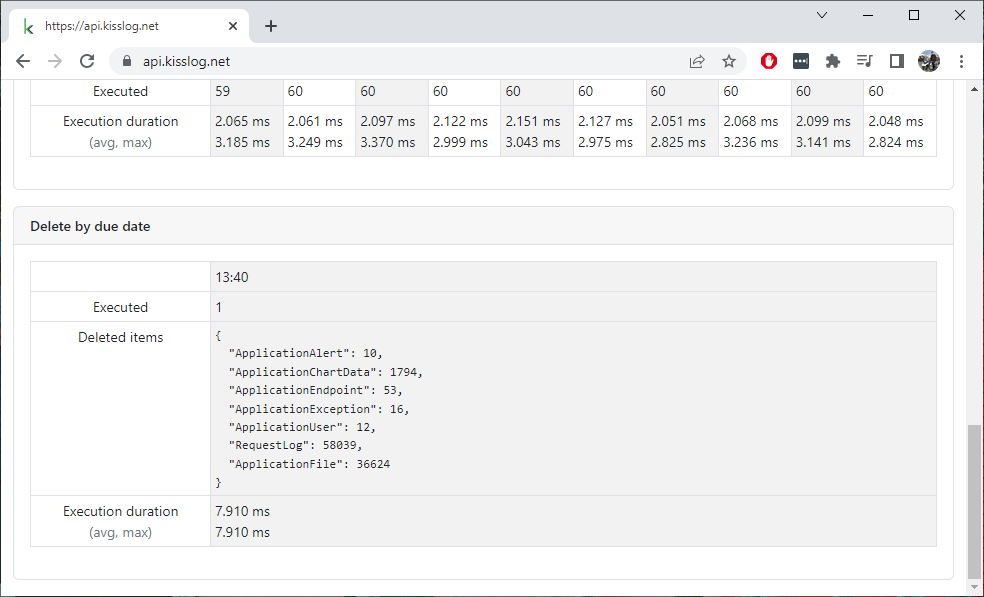
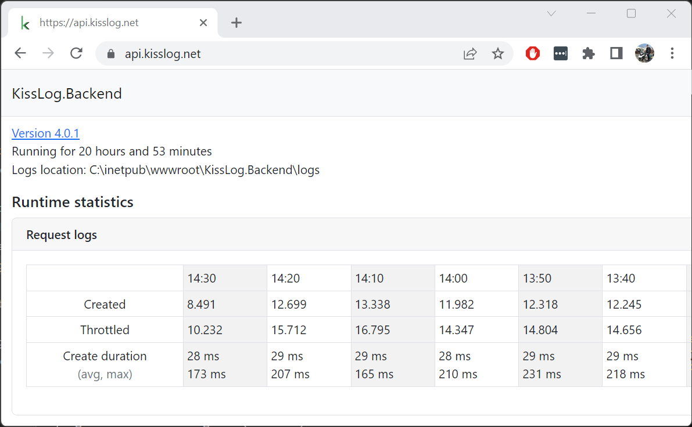

Change log
===============

.. contents:: Versions
   :local:
   :depth: 1

KissLog.Backend 6.0.1
--------------------------

Release date: 15-03-2024

https://github.com/KissLog-net/KissLog-server/releases/tag/KissLog.Backend-v6.0.1

This release is part of the complete rewrite of the KissLog.Frontend application.

Configuration changes
~~~~~~~~~~~~~~~~~~~~~~~

.. list-table::
   :header-rows: 1

   * - Added $.["KissLogFrontend.BasicAuth.Password"]
   * - | https://github.com/KissLog-net/KissLog-server/blob/bcc1eb0be8afea1f6389664a6c7e59e8ac13b872/KissLog.Backend/KissLog.json#L4

.. list-table::
   :header-rows: 1

   * - Renamed $.UserAgentParser to "UserAgentParserProvider"
   * - | https://github.com/KissLog-net/KissLog-server/blob/bcc1eb0be8afea1f6389664a6c7e59e8ac13b872/KissLog.Backend/KissLog.json#L239

.. list-table::
   :header-rows: 1

   * - Added $.KissLogFrontend
   * - | This configuration object contains the database connection used by the KissLog.Frontend application.
       | https://github.com/KissLog-net/KissLog-server/blob/bcc1eb0be8afea1f6389664a6c7e59e8ac13b872/KissLog.Backend/KissLog.json#L25

.. list-table::
   :header-rows: 1

   * - Added $.CreateRequestLog.ValidateApplicationKeys
   * - | https://github.com/KissLog-net/KissLog-server/blob/bcc1eb0be8afea1f6389664a6c7e59e8ac13b872/KissLog.Backend/KissLog.json#L41

Improvements
~~~~~~~~~~~~~~~~~~~~~~~

- Implemented ``POST /request-logs`` endpoint which can be used to manually create logs.

- KissLog.Backend now connects to KissLog.Frontend database directly.

KissLog.Backend 5.4.0
--------------------------

Release date: 21-01-2024

https://github.com/KissLog-net/KissLog-server/releases/tag/KissLog.Backend-v5.4.0

This release contains significant improvements for the process of saving requests, with the potential of reducing the average duration of saving one request from 25ms to less than 5ms.

**Configuration changes**

Introduced :ref:`UserAgentParserProvider <on-premises/kisslog-backend/configuration:useragentparserprovider>` configuration property.

.. admonition:: Update guide

   | Step 1:
   | Stop the application.

   | Step 2:
   | Add the new ``"UserAgentParser": null`` property in the `KissLog.json` configuration file.
   | Setting the value to `null` will disable UserAgent parsing (used only for user-interface purposes), but it will greatly improve the performance of the application.

   | Step 3:
   | Delete the existing `RequestLog_TextIndex` MongoDB index, as this index has been removed (in order to reduce the workload on the MongoDB server).

   .. figure:: images/change-log/remove-MongoDB-text-index.png
       :alt: Remove TextIndex

   | Step 4:
   | Update the application code using the latest release artifacts. Make sure you don't override the local configuration file. Start the application.

KissLog.Backend 5.3.0
--------------------------

Release date: 24-12-2023

https://github.com/KissLog-net/KissLog-server/releases/tag/KissLog.Backend-v5.3.0

This release improves the efficiency of saving requests, achieving up to a 1.5x improvement under specific conditions.

Previously, we identified a performance degradation when processing requests containing files.

The bottleneck originated from the default implementation of the .NET ``IFormFile``, which would write any files larger than 64KB to a temp file on disk, making the process of saving requests very IO intensive. Details available at https://stackoverflow.com/a/53750820/1157952.

KissLog.Backend 5.0.0
--------------------------

Release date: 11-05-2023

https://github.com/KissLog-net/KissLog-server/releases/tag/KissLog.Backend-v5.0.0

This release contains improvements related to alerts functionality.

If you are updating an existing instance of KissLog.Backend application, you must delete the existing records from ``AlertDefinitionInvocation`` collection before starting the new application.

.. code-block:: none
    :caption: >_MONGOSH

    > use KissLog
    < 'switched to db KissLog'
    KissLog> db.AlertDefinitionInvocation.deleteMany({})
    < {
        acknowledged: true,
        deletedCount: 23
      }

KissLog.Backend 5.0.0 is only compatible with KissLog.Frontend 5.0.0, and, for this reason, both applications must be updated at the same time.

KissLog.Backend 4.0.3
--------------------------

Release date: 31-03-2023

https://github.com/KissLog-net/KissLog-server/releases/tag/KissLog.Backend-v4.0.3

Displaying "Delete by due date" runtime statistics.

KissLog.Backend 4.0.2
--------------------------

Release date: 24-03-2023

https://github.com/KissLog-net/KissLog-server/releases/tag/KissLog.Backend-v4.0.2

Fixed javascript evaluator engine which would randomly throw errors while evaluating the alerts.

.. code-block:: none

    14:54:10.8568072Z, Error                Error trying to evaluate Javascript code:
    function(context, callback) {
        var requestLog = context.RequestLog;
        var httpStatusCode = requestLog.HttpProperties.Response.HttpStatusCode;

        return callback(httpStatusCode >= 500);
    }
    System.IndexOutOfRangeException: Index was outside the bounds of the array.
    at Jint.Engine.get_Realm()
    at Jint.Engine.GetValue(String propertyName)
    at Jint.Engine.Invoke(String propertyName, Object thisObj, Object[] arguments)
    at Jint.Engine.Invoke(String propertyName, Object[] arguments)

KissLog.Backend 4.0.1
--------------------------

Release date: 27-02-2023

https://github.com/KissLog-net/KissLog-server/releases/tag/KissLog.Backend-v4.0.1

Runtime intervals are now displayed in local time-zone.

KissLog.Backend 4.0.0
--------------------------

Release date: 23-02-2023

https://github.com/KissLog-net/KissLog-server/releases/tag/KissLog.Backend-v4.0.0

The application has been completely rewritten from scratch on .NET 6.0 framework and it is using the latest version of MongoDB 6.0 server.

With this refactoring, KissLog.Backend becomes more efficient, more stable and more adaptive for future development.

This update comes with important improvements for Microsoft Azure hosting, reducing the Cosmos DB usage by up to 40%.

.. note::
   Unfortunately, the new KissLog.Backend data schema is incompatible with the old data schema (MongoDb or AzureCosmosDb).

   After updating to KissLog.Backend 4.0.0, all the existing logs and metrics will be lost. 

   If you are updating an existing instance of KissLog.Backend, please update the MongoDB server to 6.0 and point to a new :ref:`DatabaseName <on-premises/kisslog-backend/configuration:database>`.

**KissLog.json** changes:

The configuration file has been restructured. Please start with the `template <https://github.com/KissLog-net/KissLog-server/blob/main/KissLog.Backend/KissLog.json>`_ and replace the values you need.
