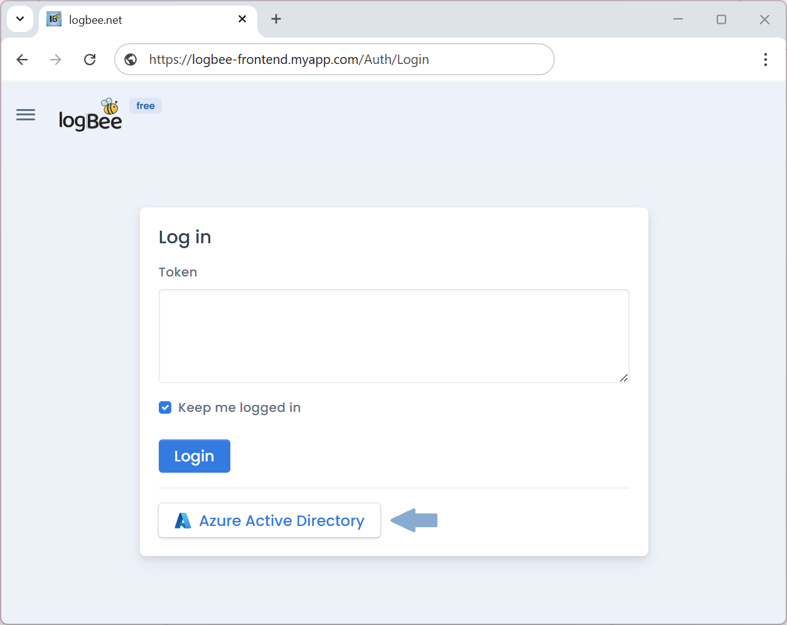
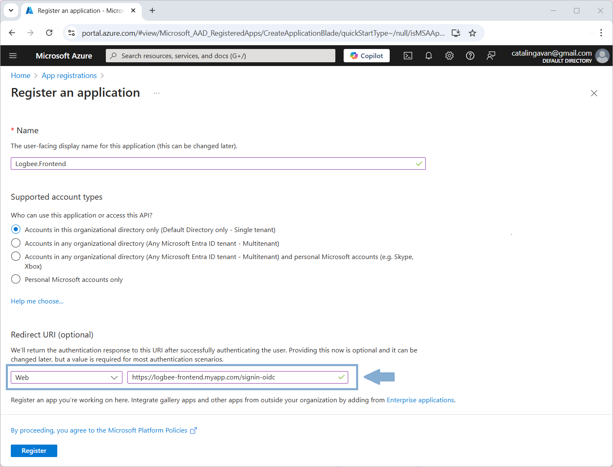
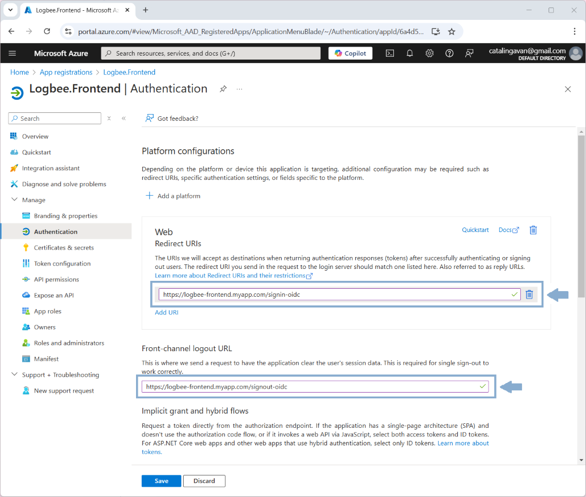
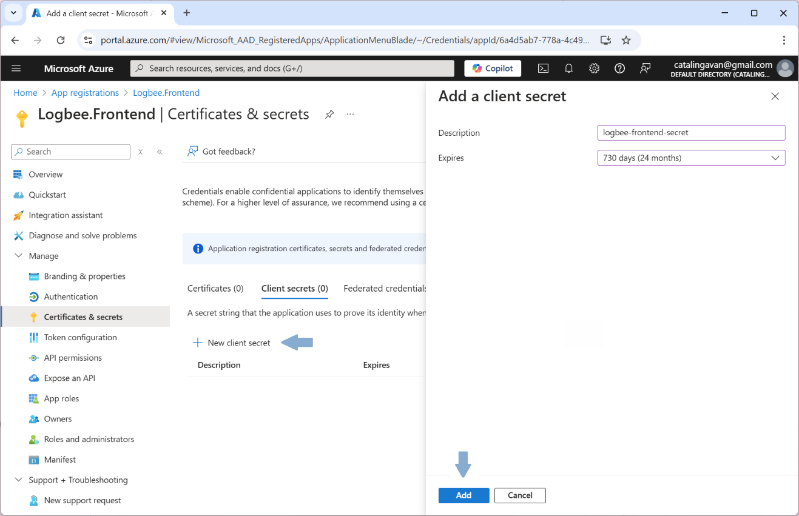
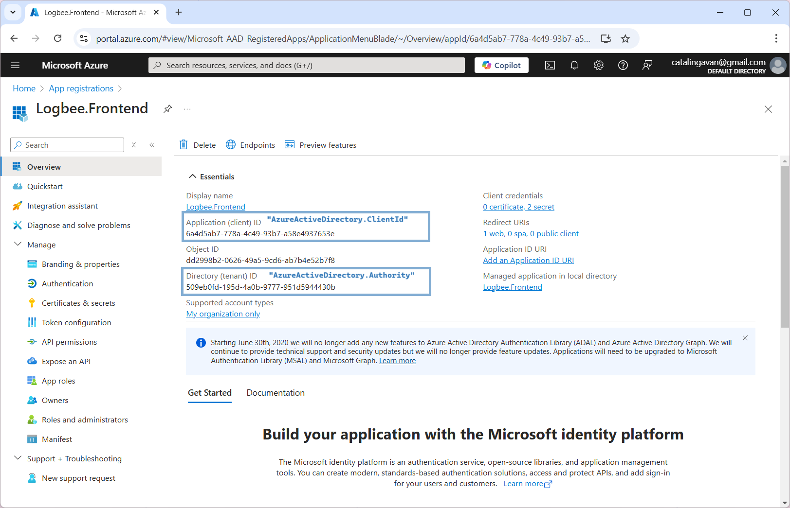

Azure Active Directory authentication
=============================================

If :ref:`$.Authorization.AzureActiveDirectory <on-premises/logbee-frontend/configuration:Authorization.AzureActiveDirectory>` is configured, you can login using the Azure Active Directory OAuth flow.

.. note::
   To enable Azure Active Directory authentication, the Logbee.Frontend application must be hosted using the ``https`` protocol.

Setting up Azure Active Directory authentication
~~~~~~~~~~~~~~~~~~~~~~~~~~~~~~~~~~~~~~~~~~~~~~~~~~~~~~~~~

\1. In Azure Portal, create a new App registration.

| Under Redirect URI, select Web, and set the URI to the following value:
| "https://logbee-frontend.myapp.com/signin-oidc" (replace with your logbee-frontend endpoint)

\2. Once the application has been created, on the let menu, navigate to "Authentication".

| Set the "Front-channel logout URL" to the following value:
| "https://logbee-frontend.myapp.com/signout-oidc" (replace with your logbee-frontend endpoint)

\3. Navigate to "Certificates & secrets" and create a new secret.

Copy the secret value under ``$.Authorization.AzureActiveDirectory.ClientSecret`` configuration property.

| \4. Update the other ``$.Authorization.AzureActiveDirectory`` configuration properties as following:
| (replace with values from your App registration)

.. code-block:: json

    {
        "Authorization": {
            "AzureActiveDirectory": {
                "ClientId": "6a4d5ab7-778a-4c49-93b7-a58e4937653e",
                "ClientSecret": "xXB8_<your_secret>",
                "Authority": "https://login.microsoftonline.com/509eb0fd-195d-4a0b-9777-951d5944430b/v2.0/",
                "AuthorizedGroupIds": []
            }
        }
    }

.. toctree::
   :hidden: 
   :maxdepth: 2
   :titlesonly:
   :includehidden:

   user-groups