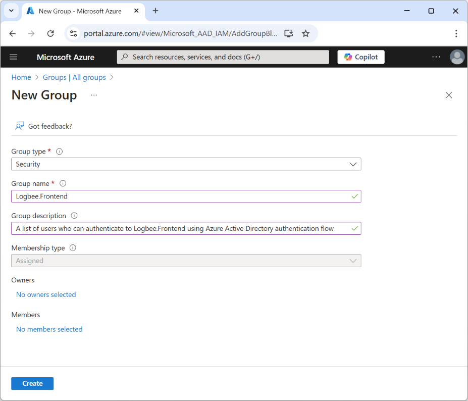
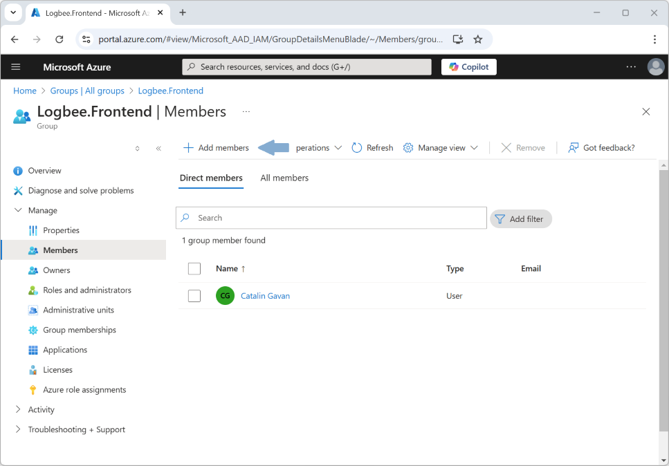
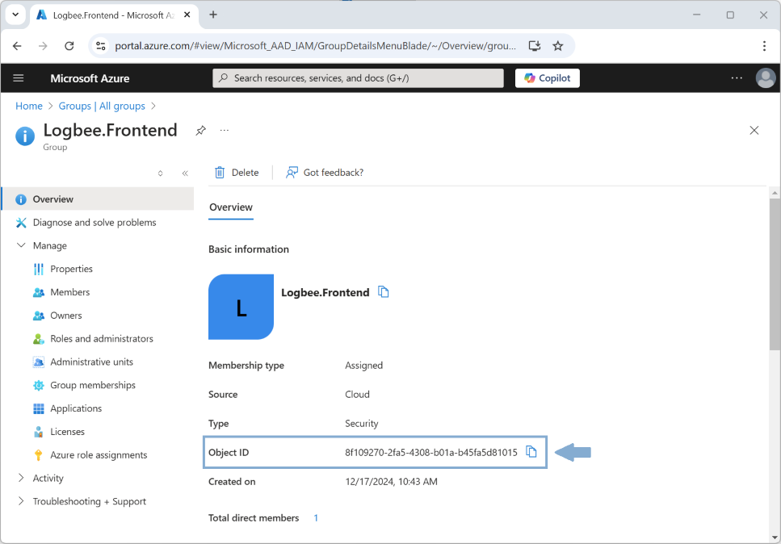
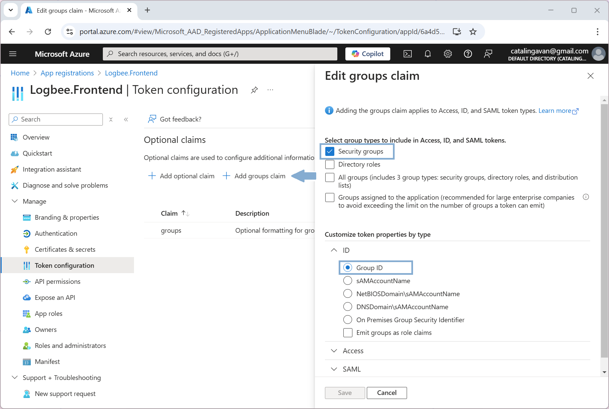

User groups
=============================================

Using Azure "Groups", you can control which Azure Active Directory (AAD) users can authenticate and access the Logbee.Frontend application.

To restrict user access, follow these steps:

\1. In Azure Portal, create a new Group. Select **Group type = Security**.

\2. Navigate under Members menu and define the list of users who can access the Logbee.Frontend application.

\3. From the Overview menu item, copy the value of "Object ID" and set it under ``$.Authorization.AzureActiveDirectory.AuthorizedGroupIds`` configuration property:

.. code-block:: json

    {
        "Authorization": {
            "AzureActiveDirectory": {
                "ClientId": "6a4d5ab7-778a-4c49-93b7-a58e4937653e",
                "ClientSecret": "xXB8_<your_secret>",
                "Authority": "https://login.microsoftonline.com/509eb0fd-195d-4a0b-9777-951d5944430b/v2.0/",
                "AuthorizedGroupIds": ["8f109270-2fa5-4308-b01a-b45fa5d81015"]
            }
        }
    }

\4. Go to Logbee.Frontend App registration, and select "Token configuration" menu item.

Click on "Add Groups claim" button and select the "Security Groups" checkbox and "Group ID" radio, and click "Save".

