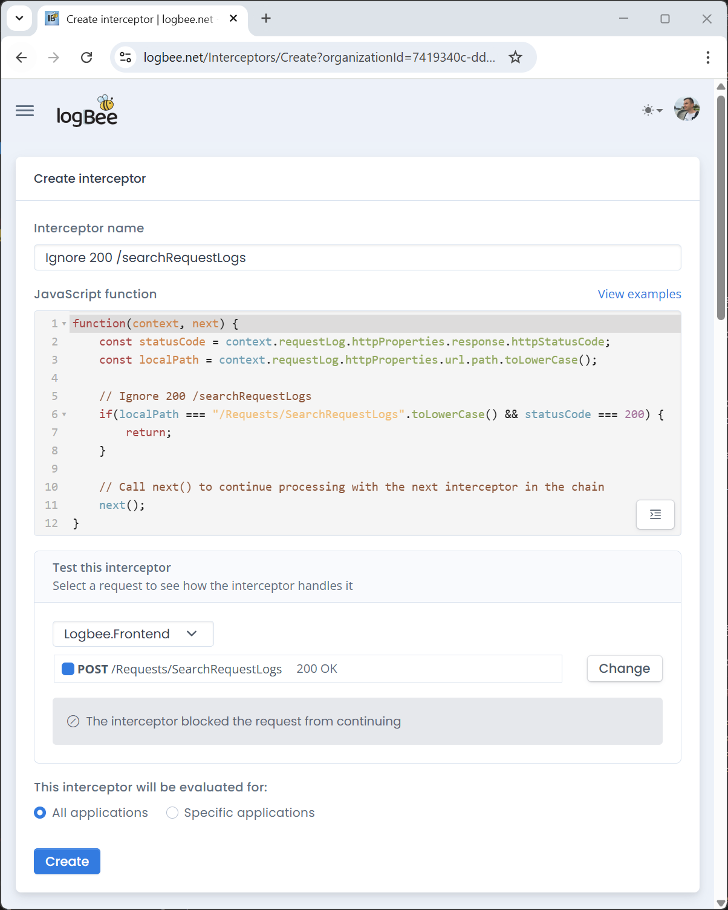

Change log
===============

.. contents:: Versions
   :local:
   :depth: 1

logbee.Frontend 2.1.1
--------------------------

Release date: 17-05-2025

https://github.com/catalingavan/logbee-app/releases/tag/logbee.Frontend-v2.1.1

Docker image: catalingavan/logbee.frontend:2.1.1

This release is compatible with :ref:`logbee.Backend-v2.1.1 <on-premises/logbee-backend/change-log:logbee.Backend 2.1.1>` or newer versions.

|

**Introduced Interceptors:**

- Interceptors are JavaScript functions that run before each request is logged.
- Useful for filtering out unwanted or repetitive requests (e.g., health checks).
- Interceptors receive a ``context`` object and a ``next()`` function.
- If ``next()`` is called, the request is logged; otherwise, it's skipped.

.. admonition:: Database migration
    :class: note

    Logbee will automatically attempt to apply the required database migration by creating the new ``Interceptor`` table. This process is expected to complete without issues.

    If you are using MySql or SqlServer as your :ref:`Database <on-premises/logbee-frontend/configuration:Database>` provider and the automatic migration fails, you can manually apply the migration script. The SQL file will be available in the ``/logs`` folder of your installation.

logbee.Frontend 2.0.0
--------------------------

Release date: 01-04-2025

https://github.com/catalingavan/logbee-app/releases/tag/logbee.Frontend-v2.0.0

Docker image: catalingavan/logbee.frontend:2.0.0

This release is compatible with :ref:`logbee.Backend-v2.0.0 <on-premises/logbee-backend/change-log:logbee.Backend 2.0.0>` or newer versions.

|

**Improvements:**

- | Refactored the application to fully support a containerized architecture.
  | For more details, see the blog post: https://logbee.net/Blog/1000/migrating-a-web-application-from-windows-to-ubuntu

- | Completely redesigned the Azure implementation and deployment process, making it more efficient and easier to set up.
  | For more details, see the :doc:`Microsoft Azure installation guide </on-premises/installation/azure/installation-guide>`.

**Configuration breaking changes:**

- Added required :ref:`LogbeeBackendConfigurationFilePath <on-premises/logbee-frontend/configuration:LogbeeBackendConfigurationFilePath>` configuration property.

.. code-block:: json
    
    {
        "LogbeeBackendConfigurationFilePath": "../../logbee.backend/Configuration/logbee.json"
    }

**Configuration changes:**

- Removed the following properties:

.. code-block:: json
    
    {
        "LogbeeBackendUrl": "http://logbee-backend.your_domain.com",
        "LogbeeBackend.BasicAuth.Password": "_LogBeeBackend_authorization_password_"
    }

- Logbee.Frontend now supports Azure Cosmos DB integration through the :ref:`AzureCosmosDb <on-premises/logbee-frontend/configuration:Database.AzureCosmosDb>` configuration option.

.. code-block:: json
    
    {
        "Database": {
            "Provider": "AzureCosmosDb",
            "AzureCosmosDb": {
                "ApplicationRegion": "West Europe",
                "ConnectionString": "https://cosmos-db-name.documents.azure.com:443/;AccountKey=_accountKeyValue_;",
                "DatabaseName": "LogbeeFrontend",
                "AzureStorageAccountConnectionString": "DefaultEndpointsProtocol=https;AccountName=storagename;AccountKey=_accountKeyValue_;EndpointSuffix=core.windows.net"
            }
        }
    }

logbee.Frontend 1.3.3
--------------------------

Release date: 15-01-2025

https://github.com/catalingavan/logbee-app/releases/tag/logbee.Frontend-v1.3.3

Introduced ``$.Authorization.AzureActiveDirectory.AuthorizedGroupIds``, which can be used to restrict Active Directory users access to the Logbee.Frontend application. 

More details can be found :doc:`here </on-premises/logbee-frontend/active-directory-auth/user-groups>`.

logbee.Frontend 1.3.0
--------------------------

Release date: 29-10-2024

https://github.com/catalingavan/logbee-app/releases/tag/logbee.Frontend-v1.3.0

This release is compatible with :ref:`logbee.Backend-v1.3.0 <on-premises/logbee-backend/change-log:logbee.Backend 1.3.0>` or newer versions.

**Bug fixes**

Fixes ``405 Method Not Allowed`` when trying to delete captured application logs and data. https://stackoverflow.com/questions/4413455/why-does-http-delete-verb-return-405-error-method-not-allowed-for-my-restful-w

**Improvements**

- Implemented caching for applications and organizations, reducing database load.

- Implemented automated job for deleting old emails in the ``EmailQueue`` table.

- Implemented automated job for deleting old local log files.

**Braking changes**

Added ApplicationSettings (required) configuration option. `logbee.json <https://github.com/catalingavan/logbee-app/blob/c370ce6c529302bb9121e0fea37c650803e4a850/logbee.Frontend/logbee.json#L44>`_

.. code-block:: json
    
    {
        "ApplicationSettings": {
            "CacheApplicationsRepositoryInSeconds": 600,
            "ProcessEmailsQueueIntervalInSeconds": 30,
            "DeleteProcessedEmails": {
                "SentMoreThanNHoursAgo": 12,
                "TriggerIntervalInMinutes": 60
            },
            "DeleteLocalLogFiles": {
                "CreatedMoreThanNDaysAgo": 3,
                "TriggerIntervalInHours": 6
            }
        }
    }

logbee.Frontend 1.2.2
--------------------------

Release date: 23-10-2024

https://github.com/catalingavan/logbee-app/releases/tag/logbee.Frontend-v1.2.2

Implemented :ref:`Smtp.Sender <on-premises/logbee-frontend/configuration:Smtp.Sender>` (optional) configuration option.

.. code-block:: json
    
    {
        "Smtp": {
            "Sender": {
                "Address": "no-reply@logbee.dev",
                "DisplayName": "Logbee"
            }
        }
    }

logbee.Frontend 1.1.6
--------------------------

Release date: 04-09-2024

https://github.com/catalingavan/logbee-app/releases/tag/logBee.Frontend-v1.1.6

Implemented "Create an alert for this exception" functionality.

.. figure:: images/change-log/create-alert-for-exception-button.png
    :alt: "Create an alert for this exception" button

logbee.Frontend 1.1.2
--------------------------

Release date: 09-07-2024

https://github.com/catalingavan/logbee-app/releases/tag/logBee.Frontend-v1.1.2

Implemented date-time plugin selector for table filters.

.. figure:: images/change-log/table-date-time-picker.png
    :alt: date-time plugin selector

logbee.Frontend 1.1.0
--------------------------

Release date: 06-06-2024

https://github.com/catalingavan/logbee-app/releases/tag/logBee.Frontend-v1.1.0

Upgraded the application to .NET 8.0

logbee.Frontend 1.0.1
--------------------------

Release date: 15-03-2024

https://github.com/catalingavan/logbee-app/releases/tag/logBee.Frontend-v1.0.1

Migrating from the legacy KissLog.Frontend
---------------------------------------------

If you are currently using the legacy KissLog.Frontend application, upgrading to the new logbee.Frontend application will bring breaking changes to both configuration file and to the database schema.

For the configuration file (KissLog.json -> logbee.json) it is best to use the new configuration file and update the properties with your settings.

logbee.Frontend is now using a new database schema incompatible with the previous KissLog.Frontend application.

To migrate the existing data, please follow these steps:

1. In the logbee.Frontend application, update your database connection string to a new database name, different than the database name used in KissLog.Frontend.

2. Run the logbee.Frontend application for the first time, which will create the empty database (with the new schema).

3. Copy the existing data from the old database to the new database, using the following script (MySql language):

.. code-block:: sql

    INSERT INTO `<NEW_DATABASE>`.`application`
    (`Id`,`Organization_Id`,`Name`,`CreatedAt`)
    SELECT `Id`, `Organization_Id`, `Name`, `DateTimeCreated`
    FROM `<OLD_DATABASE>`.`application`
    WHERE `Id` NOT IN (SELECT `Id` from `NEW_DATABASE`.`application`)

    INSERT INTO `<NEW_DATABASE>`.`organization`
    (`Id`,`Name`,`CreatedAt`)
    SELECT `Id`, `Name`, `DateTimeCreated`
    FROM `<OLD_DATABASE>`.`organization`
    WHERE `Id` NOT IN (SELECT `Id` from `<NEW_DATABASE>`.`organization`)

    INSERT INTO `<NEW_DATABASE>`.`organizationalert`
    (`Id`,
    `Organization_Id`,
    `Name`,
    `Description`,
    `JavascriptCode`,
    `ThrottleInSeconds`,
    `CreatedAt`,
    `IsEnabled`,
    `AppliesToAllApplications`,
    `EmailNotificationJson`,
    `SlackNotificationJson`,
    `MicrosoftTeamsNotificationJson`)
    SELECT
    `Id`,
    `Organization_Id`,
    `Name`,
    `Description`,
    `JavascriptCode`,
    `ThrottleInSeconds`,
    `DateTimeCreated`,
    `IsActive`,
    1,
    REPLACE(REPLACE(`EmailNotification`, '"IsActive"', '"IsEnabled"'), '"Emails"', '"SendTo"'),
    REPLACE(`SlackNotification`, '"IsActive"', '"IsEnabled"'),
    REPLACE(`MicrosoftTeamsNotification`, '"IsActive"', '"IsEnabled"')
    FROM `<OLD_DATABASE>`.`alert`
    WHERE `Id` NOT IN (SELECT `Id` from `<NEW_DATABASE>`.`organizationalert`)

If you need assistance, please feel free to reach out and I will happily help with the migration.
