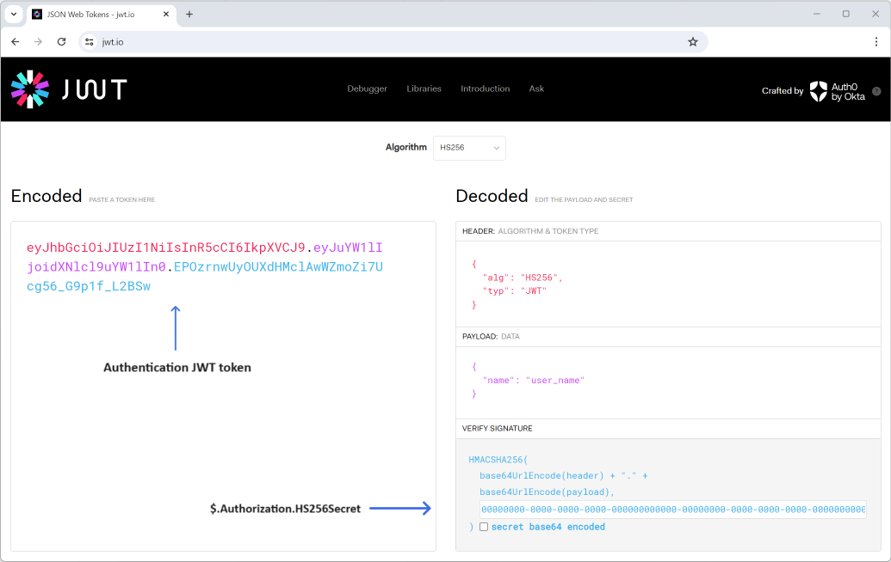

logbee.Frontend
=================================

.. contents:: Table of contents
   :local:

About
------------------------------

logbee.Frontend is a user-interface application used by developers to visualize the captured errors, logs and other metrics data.

logbee.Frontend is generating the user-interface by consuming logbee.Backend REST endpoints.

Authentication
------------------------------

logbee.Frontend uses a JSON Web Token (JWT) for authentication.

The authentication JWT must be signed with the value provided at :ref:`$.Authorization.HS256Secret <on-premises/logbee-frontend/configuration:Authorization>` property from the logbee.json configuration file.

For the default value of ``$.Authorization.HS256Secret``, you can use the following authentication JWT:

.. code-block:: none
    
    # $.Authorization.HS256Secret:
    # 00000000-0000-0000-0000-000000000000-00000000-0000-0000-0000-000000000000
    
    # Authentication token:
    eyJhbGciOiJIUzI1NiIsInR5cCI6IkpXVCJ9.e30.HP79qro7bvfH7BneUy5jB9Owc_5D2UavFDulRETAl9E

Creating the JWT
^^^^^^^^^^^^^^^^^^^^^^^^^^^^

The authentication JWT can be created programmatically or online (using https://jwt.io/, for example).  

.. figure:: images/logbee.Frontend-login.png
    :alt: logbee.Frontend login page

User name
^^^^^^^^^^^^^^^^^^^^^^^^^^^^

Authenticated user name is used for display purposes only, and it can be specified in one of the following options:

- at the end of the JWT, appended as ``@user_name``

.. code-block:: none
    
    # Authentication token:
    eyJhbGciOiJIUzI1NiIsInR5cCI6IkpXVCJ9.e30.HP79qro7bvfH7BneUy5jB9Owc_5D2UavFDulRETAl9E@user_name

- in the JWT payload using any of these claims: "emailAddress", "email", "preferred_username", "name"

Auto-login
^^^^^^^^^^^^^^^^^^^^^^^^^^^^

You can automate the login process by directly passing the Authentication token in the login url, using the `token=value` query string parameter.

.. code-block:: none
    
    # Authentication url:
    http://localhost:44080/Auth/Login?token=eyJhbGciOiJIUzI1NiIsInR5cCI6IkpXVCJ9.e30.HP79qro7bvfH7BneUy5jB9Owc_5D2UavFDulRETAl9E

Bookmarking this url will allow for a faster login process.

.. toctree::
   :hidden: 
   :maxdepth: 2
   :titlesonly:
   :includehidden:

   configuration
   change-log
   active-directory-auth/index