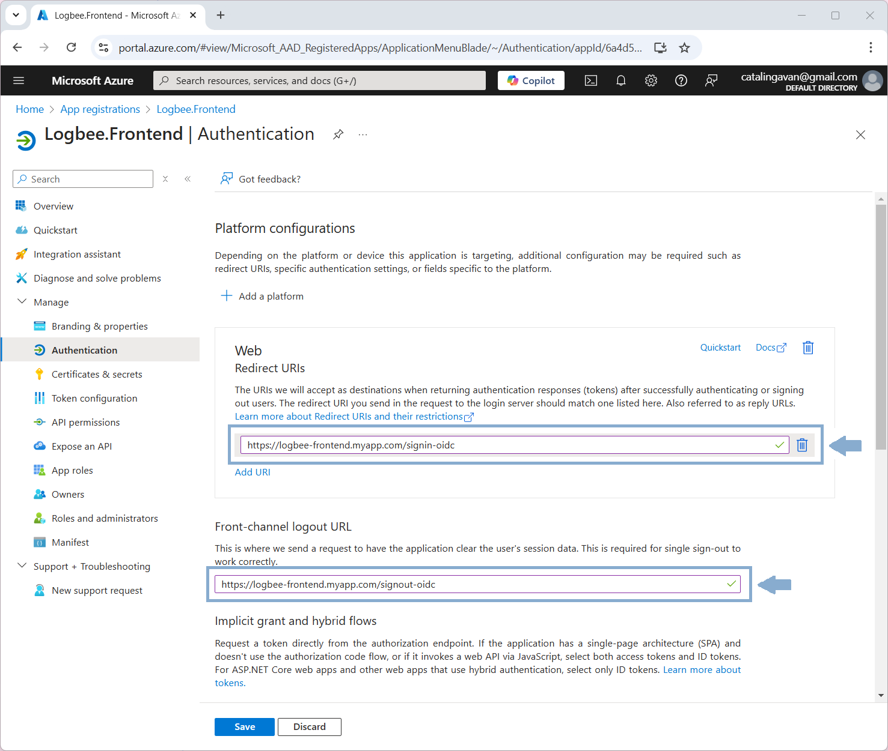

logbee.Frontend
=================================

.. contents:: Table of contents
   :local:

About
------------------------------

logbee.Frontend is a user-interface application used by developers to visualize the captured errors, logs and other metrics data.

logbee.Frontend is generating the user-interface by consuming logbee.Backend REST endpoints.

Authentication
------------------------------

logbee.Frontend uses a JSON Web Token (JWT) for authentication.

The authentication JWT must be signed with the value provided at :ref:`$.Authorization.HS256Secret <on-premises/logbee-frontend/configuration:Authorization>` property from the logbee.json configuration file.

For the default value of ``$.Authorization.HS256Secret``, you can use the following authentication JWT:

.. code-block:: none
    
    # $.Authorization.HS256Secret:
    # 00000000-0000-0000-0000-000000000000-00000000-0000-0000-0000-000000000000
    
    # Authentication token:
    eyJhbGciOiJIUzI1NiIsInR5cCI6IkpXVCJ9.e30.HP79qro7bvfH7BneUy5jB9Owc_5D2UavFDulRETAl9E

Creating the JWT
^^^^^^^^^^^^^^^^^^^^^^^^^^^^

The authentication JWT can be created programmatically or online (using https://jwt.io/, for example).  

.. figure:: images/generating-authentication-jwt.png
    :alt: Generating authentication JWT

.. figure:: images/logbee.Frontend-login.png
    :alt: logbee.Frontend login page

User name
^^^^^^^^^^^^^^^^^^^^^^^^^^^^

Authenticated user name is used for display purposes only, and it can be specified in one of the following options:

- at the end of the JWT, appended as ``@user_name``

.. code-block:: none
    
    # Authentication token:
    eyJhbGciOiJIUzI1NiIsInR5cCI6IkpXVCJ9.e30.HP79qro7bvfH7BneUy5jB9Owc_5D2UavFDulRETAl9E@user_name

- in the JWT payload using any of these claims: "emailAddress", "email", "preferred_username", "name"

Auto-login
^^^^^^^^^^^^^^^^^^^^^^^^^^^^

You can automate the login process by directly passing the Authentication token in the login url, using the `token=value` query string parameter.

.. code-block:: none
    
    # Authentication url:
    http://localhost:44080/Auth/Login?token=eyJhbGciOiJIUzI1NiIsInR5cCI6IkpXVCJ9.e30.HP79qro7bvfH7BneUy5jB9Owc_5D2UavFDulRETAl9E

Bookmarking this url will allow for a faster login process.

Azure Active Directory
^^^^^^^^^^^^^^^^^^^^^^^^^^^^^^^^

If :ref:`$.Authorization.AzureActiveDirectory <on-premises/logbee-frontend/configuration:Authorization.AzureActiveDirectory>` is configured, you can login using the Azure Active Directory OAuth flow.

.. figure:: images/logbee.Frontend-azureActiveDirectory-login.png
    :alt: logbee.Frontend Azure Active Directory login option

Setting up Azure Active Directory
~~~~~~~~~~~~~~~~~~~~~~~~~~~~~~~~~~~~~~~~~~~~~~~~~~~~~~~~~

**Steps**

\1. In Azure Portal, create a new App registration.

| Under Redirect URI, select Web, and set the URI to the following value:
| "https://logbee-frontend.myapp.com/signin-oidc" (replace with your logbee-frontend endpoint)

.. note::
   In order for the Active Directory authentication to work, the logbee-frontend application must be hosted under ``https`` protocol.

.. figure:: images/azure-ad/Create_AppRegistration.png
    :alt: Creating App registration

\2. Once the application has been created, on the let menu, navigate to "Authentication".

| Set the "Front-channel logout URL" to the following value:
| "https://logbee-frontend.myapp.com/signout-oidc" (replace with your logbee-frontend endpoint)

\3. Navigate to "Certificates & secrets" and create a new secret.

Copy the secret value under ``$.Authorization.AzureActiveDirectory.ClientSecret`` configuration property.

.. figure:: images/azure-ad/AppRegistration_Secret.png
    :alt: App registration create Secret

| \4. Update the other ``$.Authorization.AzureActiveDirectory`` configuration properties as following:
| (replace with values from your App registration)

.. code-block:: json

    {
        "Authorization": {
            "AzureActiveDirectory": {
                "ClientId": "6a4d5ab7-778a-4c49-93b7-a58e4937653e",
                "ClientSecret": "xXB8_<your_secret>",
                "Authority": "https://login.microsoftonline.com/509eb0fd-195d-4a0b-9777-951d5944430b/v2.0/",
                "AuthorizedGroupIds": []
            }
        }
    }

.. figure:: images/azure-ad/AppRegistration_Overview.png
    :alt: App registration overview

.. toctree::
   :hidden: 
   :maxdepth: 2
   :titlesonly:
   :includehidden:

   configuration
   change-log