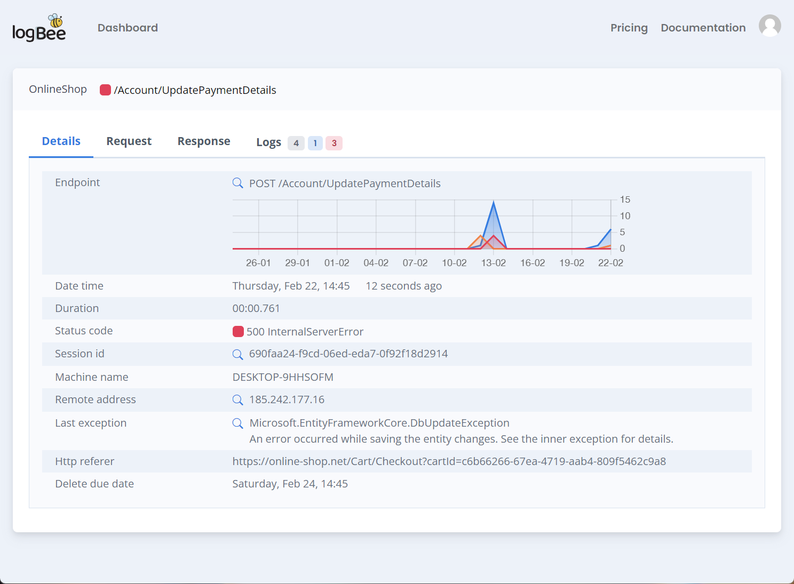

About Logbee
====================

Logbee is a **centralized platform for log aggregation, exception tracking, and application performance monitoring (APM)**. It helps developers capture, analyze, and troubleshoot application behavior in real time.

With an intuitive user interface, Logbee simplifies log management, making it easy to monitor system activity and diagnose issues efficiently.

Features
-----------------------------

- **Cross-platform hosting** - Deploy on Windows, Linux, Azure, or as a containerized application
- **High performance & scalable** - Optimized for speed and large-scale log processing
- **Easy configuration** - Customize the application behavior through a simple JSON configuration file
- **Built on .NET8**

:doc:`Integrations </integrations/index>`
----------------------------------------------------------

- **.NET** - Serilog | KissLog
- **Node.js** - ExpressJS
- **OpenTelemetry** - Traces & logs
- **REST API** - Send logs using HTTP requests

User interface
-----------------------------

   .. caption:: Request captured on Logbee

.. toctree::
   :maxdepth: 2
   :titlesonly:
   :includehidden:

   self
   ../integrations/index
   ../on-premises/index
   ../licensing/index
   ../TermsOfService
   ../PrivacyPolicy